# Tom Build Base v2 — CLI Framework Design

This document specifies the v2 architecture for `tom_build_base`, the foundational library that powers all Tom Framework CLI tools. The v2 implementation enables unified CLI patterns, configuration-free operation, and reusable traversal logic across tools, TUIs, and scripts.

**Goals:**
- Unify CLI patterns across all Tom tools (buildkit, testkit, issuekit, d4rtgen, astgen, etc.)
- Enable configuration-free operation through comprehensive folder scanning
- Provide reusable traversal logic for CLI, TUI, REPL, and D4rt scripts
- Support declarative tool/command definitions with automatic help generation
- Allow gradual migration from v1 to v2 (separate source tree)

---

## Table of Contents

1. [Overview](#overview)
   - [The Tool Building Challenge](#the-tool-building-challenge)
   - [Architecture Overview](#architecture-overview)
   - [Tool Types](#tool-types)
   - [Core Design Principles](#core-design-principles)
2. [Usage Scenarios](#usage-scenarios)
   - [Scenario 1: CLI Tool Invocation](#scenario-1-cli-tool-invocation)
   - [Scenario 2: TUI Interactive Mode](#scenario-2-tui-interactive-mode)
   - [Scenario 3: D4rt Script Traversal](#scenario-3-d4rt-script-traversal)
   - [Scenario 4: REPL Tool](#scenario-4-repl-tool)
3. [Project Traversal](#project-traversal)
   - [Traversal Pipeline Overview](#traversal-pipeline-overview)
   - [Phase 1: Argument Parsing](#phase-1-argument-parsing)
   - [Phase 2: Root Resolution](#phase-2-root-resolution)
   - [Phase 3: Folder Scanning](#phase-3-folder-scanning)
   - [Phase 4: Global Filter Application](#phase-4-global-filter-application)
   - [Phase 5: Nature Detection](#phase-5-nature-detection)
   - [Phase 6: Command Execution](#phase-6-command-execution)
   - [Filter Precedence and Order](#filter-precedence-and-order)
   - [Per-Command Filtering](#per-command-filtering)
   - [Git Traversal Mode](#git-traversal-mode)
4. [Folder Natures](#folder-natures)
   - [FsFolder and RunFolder](#fsfolder-and-runfolder)
   - [Nature Types](#nature-types)
   - [Detection Rules](#detection-rules)
   - [CommandContext API](#commandcontext-api)
5. [Tool and Command Definitions](#tool-and-command-definitions)
   - [ToolDefinition](#tooldefinition)
   - [CommandDefinition](#commanddefinition)
   - [OptionDefinition](#optiondefinition)
   - [Standalone Commands](#standalone-commands)
6. [Standard CLI Features](#standard-cli-features)
   - [Version and Help](#version-and-help)
   - [Standard Options](#standard-options)
   - [Positional Arguments](#positional-arguments)
   - [Project IDs](#project-ids)
   - [Test Project Modes](#test-project-modes)
7. [API for Programmatic Use](#api-for-programmatic-use)
   - [TraversalInfo Class](#traversalinfo-class)
   - [BuildBase.traverse() API](#buildbasetraverse-api)
   - [D4rt Script Integration](#d4rt-script-integration)
   - [TUI Integration](#tui-integration)
8. [Library Integration](#library-integration)
   - [Core Dependencies](#core-dependencies)
   - [Interactive Libraries](#interactive-libraries)
   - [Output and Formatting](#output-and-formatting)
   - [Shell Completion](#shell-completion)
9. [Migration Strategy](#migration-strategy)
   - [v2 Source Structure](#v2-source-structure)
   - [Migration Path](#migration-path)
   - [Backward Compatibility](#backward-compatibility)
10. [Implementation Phases](#implementation-phases)

---

## Overview

### The Tool Building Challenge

The Tom Framework workspace contains 50+ projects across multiple git repositories. Building tools that operate across this workspace presents several challenges:

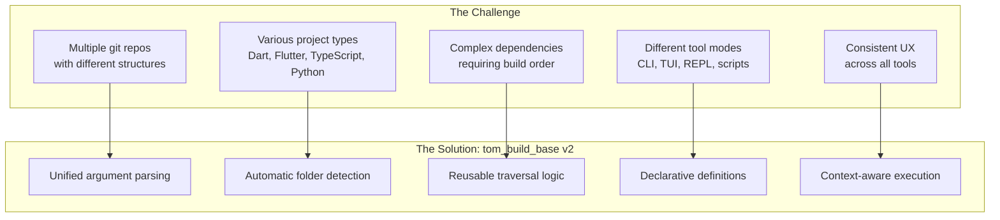

**Key insight:** The same traversal logic that a CLI tool uses should be directly callable from a TUI, a D4rt script, or any other context — without re-parsing command-line arguments.

### Architecture Overview

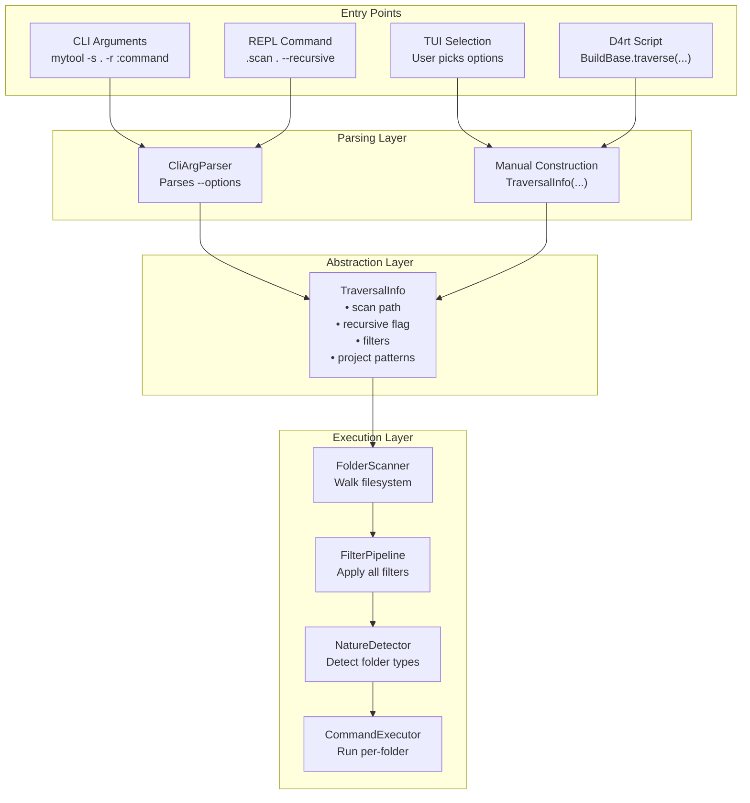

### Tool Types

tom_build_base v2 supports five distinct tool types:

| Type | Description | Examples | Key Traits |
|------|-------------|----------|------------|
| **Simple CLI** | Single-purpose tool | `versioner`, `compiler`, `astgen` | Options only, no subcommands |
| **Multi-Command** | Tool with `:command` subcommands | `buildkit`, `testkit`, `issuekit` | Command pipeline support |
| **REPL** | Interactive interpreter | `dcli`, `d4rt`, `tom` | Sessions, history, custom commands |
| **TUI** | Full-screen terminal UI | `testkit --tui` | Interactive traversal triggers |
| **Stdin/Pipe** | Batch processing | `d4rt --stdin` | Read from stdin, auto-wrap |

### Core Design Principles

1. **Configuration-free by default** — Tools detect project types, dependencies, and structure automatically through folder scanning. Configuration files override defaults but aren't required.

2. **Separation of concerns** — Argument parsing produces `TraversalInfo`; traversal consumes `TraversalInfo`. The traversal API doesn't know where its configuration came from.

3. **Declarative definitions** — Tools and commands declare their capabilities; the framework generates help, validates options, and routes execution.

4. **Flexible context** — Commands receive rich context about each folder (path, natures, metadata) and only process folders matching their requirements.

5. **Gradual adoption** — v2 coexists with v1; tools migrate one at a time.

---

## Usage Scenarios

### Scenario 1: CLI Tool Invocation

The most common scenario — user runs a tool from the command line.

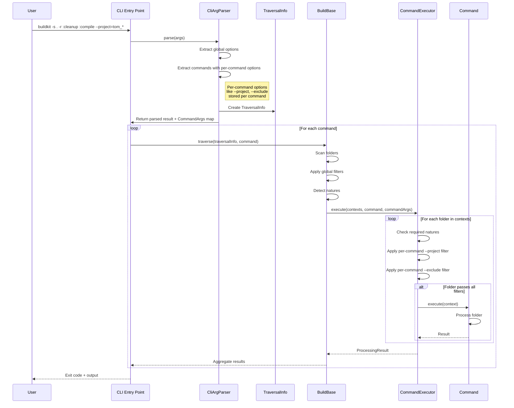

**Example invocation:**
```bash
# Run cleanup then compile on all Dart projects recursively
buildkit -s . -r :cleanup :compile

# Same but skip test projects
buildkit -s . -r --exclude="zom_*" :cleanup :compile

# Run only on specific projects using project IDs
buildkit -p BB,D4G :compile
```

### Scenario 2: TUI Interactive Mode

User launches TUI and interactively selects traversal options.

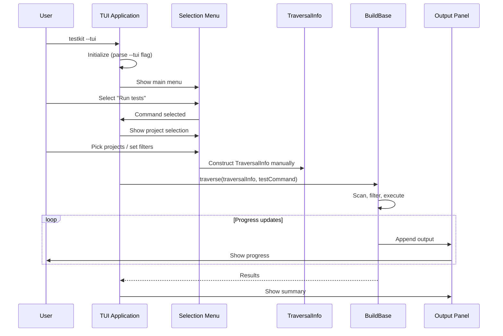

**Key difference:** TUI constructs `TraversalInfo` directly from user selections, not from command-line arguments.

```dart
// TUI constructs TraversalInfo manually
final traversalInfo = TraversalInfo(
  scan: selectedPath,
  recursive: recursiveCheckbox.isChecked,
  projectPatterns: selectedProjects,
  excludePatterns: excludedProjects,
  executionRoot: workspaceRoot,
);

await BuildBase.traverse(
  info: traversalInfo,
  run: (context) async {
    // Execute selected command
    return await testCommand.execute(context);
  },
);
```

### Scenario 3: D4rt Script Traversal

A D4rt script needs to traverse projects programmatically.

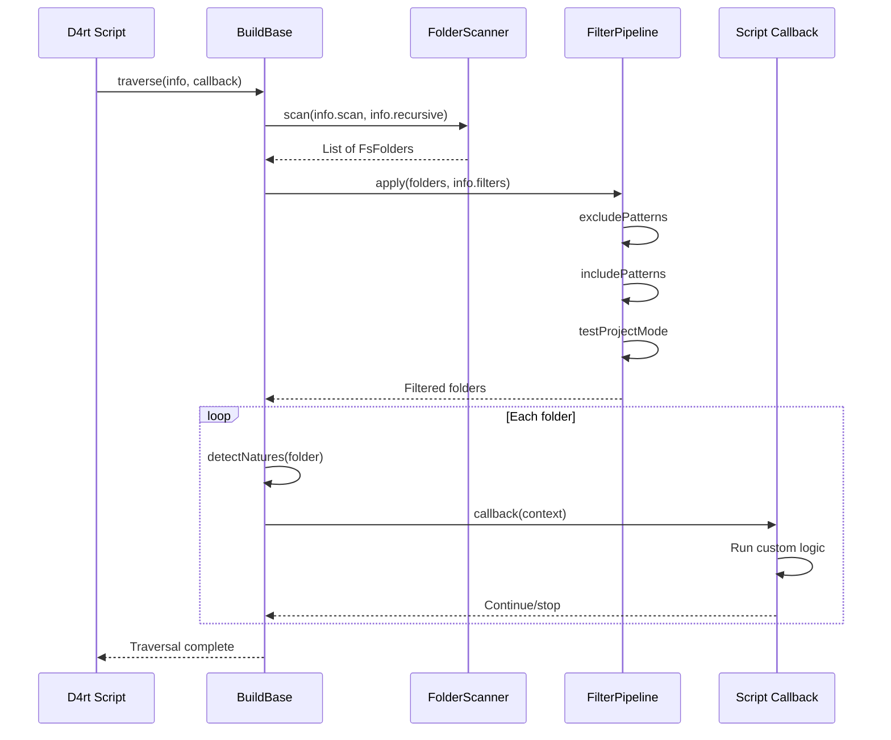

**Example D4rt script:**
```dart
// In a .d4rt script
import 'package:tom_build_base/tom_build_base_v2.dart';

void main() async {
  await BuildBase.traverse(
    info: TraversalInfo(
      scan: '.',
      recursive: true,
      includePatterns: ['tom_*'],
    ),
    run: (ctx) async {
      if (ctx.hasNature<DartProjectFolder>()) {
        print('Found Dart project: ${ctx.name}');
        // Call dcli functions, run analysis, etc.
        await shell('dart analyze', workingDirectory: ctx.path);
      }
      return true; // Continue to next folder
    },
  );
}
```

### Scenario 4: REPL Tool

REPL tools (dcli, d4rt, tom) handle arguments differently — some trigger traversal, others start the interactive session.

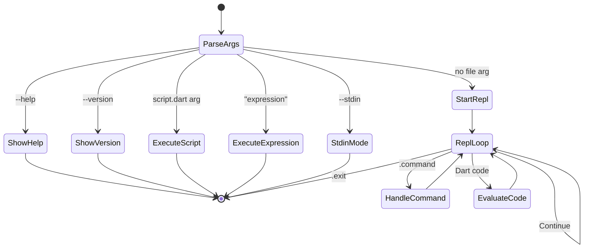

**REPL and tom_build_base integration:**

REPLs can use tom_build_base in two ways:

1. **REPL commands use traversal** — Built-in REPL commands (like `.gitstatus`, `.analyze`) can use `BuildBase.traverse()` internally to implement their functionality.

2. **D4rt scripts in REPL** — Users can run D4rt scripts from within any REPL session, and those scripts can import and use tom_build_base.

**REPL command implementation:**

```dart
/// Example REPL command that uses traversal internally.
class GitStatusReplCommand extends ReplCommand {
  @override
  String get name => 'gitstatus';
  
  @override
  String get usage => '.gitstatus [options]';
  
  @override
  Future<void> execute(String argsLine) async {
    // Parse the argument line as if it were a command line
    final traversalInfo = CliArgParser.parseCommandLine(argsLine);
    
    await BuildBase.traverse(
      info: traversalInfo,
      requiredNatures: {GitFolder},
      run: (ctx) async {
        final git = ctx.getNature<GitFolder>();
        if (git.hasUncommittedChanges || git.hasUnpushedCommits) {
          print('${ctx.name}: ${git.currentBranch}');
          if (git.hasUncommittedChanges) print('  uncommitted changes');
          if (git.hasUnpushedCommits) print('  unpushed commits');
        }
        return true;
      },
    );
  }
}
```

**String-based argument parsing:**

For REPL use, tom_build_base provides methods that accept a command-line string directly:

```dart
/// Parse a command-line string into TraversalInfo.
/// Handles shell-like quoting and escaping.
static TraversalInfo parseCommandLine(String commandLine) {
  final args = _splitCommandLine(commandLine);
  return CliArgParser.parse(args).toTraversalInfo();
}

/// Split a command line into arguments, respecting quotes.
/// Examples:
///   '-s . -r' → ['-s', '.', '-r']
///   '--exclude="zom_*"' → ['--exclude=zom_*']
///   '-p "My Project"' → ['-p', 'My Project']
static List<String> _splitCommandLine(String line) {
  // Handle quoted strings, escaped characters, etc.
  // ...
}
```

**Example REPL session:**

```
d4rt> .gitstatus -s . -r
tom_build_base: main
  uncommitted changes
tom_d4rt: main
  unpushed commits

d4rt> .analyze --project=tom_* --exclude=tom_test_*
Analyzing tom_build_base...
Analyzing tom_d4rt...
No issues found.
```

**tom_build_base also provides:**
- Argument parsing for `--help`, `--version`, stdin mode
- Session/history infrastructure
- Help text generation

---

## Project Traversal

### Traversal Pipeline Overview

Project traversal is the core operation: walking the filesystem, filtering to relevant folders, detecting what each folder is, and executing commands. This section details each phase.

```mermaid
flowchart TB
    subgraph "Phase 1: Argument Parsing"
        A1["Command-line args<br/>or manual TraversalInfo"]
        A2["Parse global options"]
        A3["Parse per-command options<br/>(--project, --exclude per :cmd)"]
        A4["Create TraversalInfo +<br/>CommandArgs map"]
    end
    
    subgraph "Phase 2: Root Resolution"
        B1["Resolve execution root"]
        B2["Find workspace boundary"]
        B3["Handle -R (bare root)"]
    end
    
    subgraph "Phase 3: Folder Scanning"
        C1["Start from scan path"]
        C2["Recursive or single level"]
        C3["Skip folders with<br/>buildkit_skip.yaml"]
        C4["Build folder tree"]
    end
    
    subgraph "Phase 4: Global Filter Application"
        D1["1. Recursion exclude<br/>(already applied during scan)"]
        D2["2. Path exclude patterns"]
        D3["3. Project name patterns"]
        D4["4. Module filter<br/>(git submodules)"]
        D5["5. Test project filter"]
    end
    
    subgraph "Phase 5: Nature Detection"
        E1["Check key files"]
        E2["Assign folder natures"]
        E3["Extract project IDs<br/>from buildkit.yaml"]
        E4["Build CommandContext"]
    end
    
    subgraph "Phase 6: Command Execution"
        F1["Filter by required natures"]
        F2["Apply per-command --project"]
        F3["Apply per-command --exclude"]
        F4["Execute command"]
        F5["Collect results"]
    end
    
    A1 --> A2 --> A3 --> A4
    A4 --> B1 --> B2 --> B3
    B3 --> C1 --> C2 --> C3 --> C4
    C4 --> D1 --> D2 --> D3 --> D4 --> D5
    D5 --> E1 --> E2 --> E3 --> E4
    E4 --> F1 --> F2 --> F3 --> F4 --> F5
```

### Phase 1: Argument Parsing

**Input:** Raw command-line arguments or programmatic construction.

**Output:** `TraversalInfo` object containing all traversal parameters.

```dart
/// Parsed command-line arguments before conversion to TraversalInfo.
class CliArgs {
  // Global navigation options
  final String? scan;
  final bool recursive;      // -r, --recursive
  final bool notRecursive;   // --not-recursive (explicit non-recursive)
  final String? root;
  final bool bareRoot;
  final List<String> excludePatterns;
  final List<String> excludeProjects;
  final List<String> recursionExclude;
  final List<String> projectPatterns;
  final List<String> modules;       // --modules, -m (include git submodules)
  final List<String> skipModules;   // --skip-modules (exclude git submodules)
  final bool buildOrder;
  final bool innerFirstGit;
  final bool outerFirstGit;
  final bool workspaceRecursion;
  
  // Standard options
  final bool verbose;
  final bool dryRun;
  final bool listOnly;
  final String? configPath;
  final bool dumpConfig;
  final bool guide;
  final bool force;
  
  // Test project options
  final bool includeTestProjects;
  final bool testProjectsOnly;
  
  // Positional arguments (non-option)
  final List<String> positionalArgs;
  
  // Per-command args (for multi-command tools)
  final Map<String, CommandArgs> commandArgs;
  
  /// Convert to TraversalInfo for use with BuildBase.traverse()
  TraversalInfo toTraversalInfo() => TraversalInfo.fromCliArgs(this);
}
```

**Positional argument handling:**

```bash
# Positional args come after options, before :commands
mytool script.dart            # positionalArgs: ['script.dart']
mytool -v "expression"        # positionalArgs: ['expression']
mytool file1.dart file2.dart  # positionalArgs: ['file1.dart', 'file2.dart']
mytool -s . :command          # positionalArgs: [] (no positional args)
```

### Phase 2: Root Resolution

Determines the workspace root for traversal.

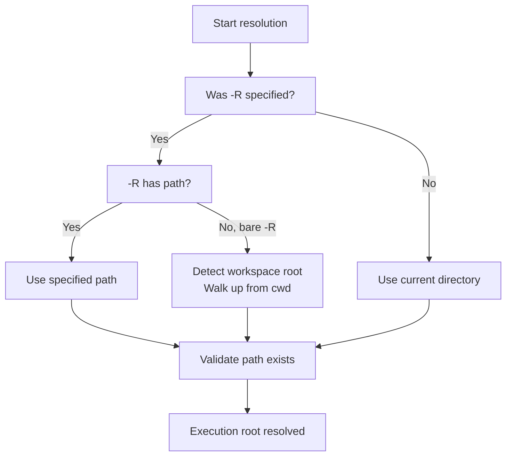

**Workspace boundary detection:**
```dart
bool isWorkspaceBoundary(String dirPath) {
  // Check for workspace marker files
  return File('$dirPath/buildkit_master.yaml').existsSync() ||
         File('$dirPath/tom_workspace.yaml').existsSync() ||
         File('$dirPath/tom.code-workspace').existsSync();
}
```

### Phase 3: Folder Scanning

Walks the filesystem to discover folders. **Skip markers are checked during scan** to avoid descending into skipped subtrees entirely.

```dart
class FolderScanner {
  /// Scan for folders starting from [root].
  /// 
  /// [recursive] - If true, descend into subdirectories
  /// [recursionExclude] - Patterns to skip during recursive descent
  Future<List<FsFolder>> scan(
    String root, {
    bool recursive = false,
    List<String> recursionExclude = const [],
  }) async {
    final folders = <FsFolder>[];
    
    await _scanDirectory(
      Directory(root),
      folders,
      recursive: recursive,
      recursionExclude: recursionExclude,
    );
    
    return folders;
  }
  
  Future<void> _scanDirectory(
    Directory dir,
    List<FsFolder> results, {
    required bool recursive,
    required List<String> recursionExclude,
  }) async {
    // Check for skip markers BEFORE adding or descending
    // This skips the entire subtree when a skip marker is found
    if (_hasSkipMarker(dir.path)) {
      return; // Skip this folder and all descendants
    }
    
    // Add this directory
    results.add(FsFolder(path: dir.path));
    
    if (!recursive) return;
    
    // Descend into subdirectories
    await for (final entity in dir.list()) {
      if (entity is Directory) {
        final name = p.basename(entity.path);
        
        // Skip hidden directories
        if (name.startsWith('.')) continue;
        
        // Apply recursion exclusions (during scan)
        if (_matchesAny(entity.path, recursionExclude)) continue;
        
        await _scanDirectory(
          entity,
          results,
          recursive: recursive,
          recursionExclude: recursionExclude,
        );
      }
    }
  }
  
  /// Check for skip markers that exclude entire subtrees.
  bool _hasSkipMarker(String dirPath) {
    // buildkit_skip.yaml - skip this folder and all descendants
    if (File(p.join(dirPath, 'buildkit_skip.yaml')).existsSync()) {
      return true;
    }
    // buildkit_master.yaml - separate buildkit workspace, treat as boundary
    if (File(p.join(dirPath, 'buildkit_master.yaml')).existsSync()) {
      return true;
    }
    return false;
  }
}
```

**Skip markers:**

| Marker File | Behavior |
|-------------|----------|
| `buildkit_skip.yaml` | Skip this folder and all descendants |
| `buildkit_master.yaml` | Buildkit workspace root — treated as skip to avoid entering nested workspaces |

### Phase 4: Global Filter Application

Filters reduce the scanned folders to those matching criteria. These are **global filters** that apply to all commands. Per-command filters are applied later in Phase 6.

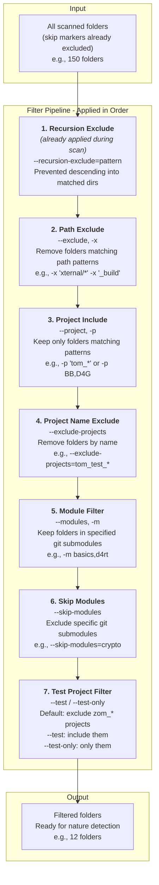

#### Filter Details

| # | Filter | Flag | When Applied | Behavior |
|---|--------|------|--------------|----------|
| 0 | Skip Markers | (automatic) | **During scan** | `buildkit_skip.yaml` skips entire subtree |
| 1 | Recursion Exclude | `--recursion-exclude` | During scan | Prevents descending into matched dirs |
| 2 | Path Exclude | `--exclude`, `-x` | After scan | Removes folders matching path patterns |
| 3 | Project Include | `--project`, `-p` | After scan | Keeps only folders matching patterns or project IDs |
| 4 | Project Name Exclude | `--exclude-projects` | After scan | Removes folders by name (not path) |
| 5 | Module Filter | `--modules`, `-m` | After scan | Keeps folders in specified git submodules |
| 6 | Skip Modules | `--skip-modules` | After scan | Excludes specific git submodules |
| 7 | Test Project | `--test` / `--test-only` | After scan | Controls zom_* project inclusion |

**Filter implementation:**

```dart
class FilterPipeline {
  List<FsFolder> apply(List<FsFolder> folders, TraversalInfo info) {
    var result = folders;
    
    // 2. Path exclude (--exclude, -x)
    if (info.excludePatterns.isNotEmpty) {
      result = result.where((f) => 
        !_matchesAny(f.path, info.excludePatterns)
      ).toList();
    }
    
    // 3. Project include (--project, -p)
    if (info.projectPatterns.isNotEmpty) {
      result = result.where((f) => 
        _matchesAny(f.path, info.projectPatterns) ||
        _matchesAny(f.name, info.projectPatterns) ||
        _matchesProjectId(f, info.projectPatterns)
      ).toList();
    }
    
    // 4. Project name exclude (--exclude-projects)
    if (info.excludeProjects.isNotEmpty) {
      result = result.where((f) => 
        !_matchesAny(f.name, info.excludeProjects)
      ).toList();
    }
    
    // 5. Module filter (--modules, -m)
    // Keeps folders that are within the specified git submodules
    if (info.modules.isNotEmpty) {
      result = _applyModulesFilter(result, info.modules);
    }
    
    // 6. Skip modules filter (--skip-modules)
    // Excludes folders within the specified git submodules
    if (info.skipModules.isNotEmpty) {
      result = _applySkipModulesFilter(result, info.skipModules);
    }
    
    // 7. Test project filter
    if (info.testProjectsOnly) {
      result = result.where((f) => f.name.startsWith('zom_')).toList();
    } else if (!info.includeTestProjects) {
      result = result.where((f) => !f.name.startsWith('zom_')).toList();
    }
    
    // Note: Skip file (buildkit_skip.yaml) is checked during SCAN phase,
    // not here. This ensures entire subtrees are skipped efficiently.
    
    return result;
  }
}
```

### Phase 5: Nature Detection

After filtering, each folder is analyzed to determine its "natures" — what type of project/folder it is. This phase also extracts metadata like **project IDs** from configuration files.

```dart
class NatureDetector {
  List<RunFolder> detectNatures(FsFolder folder) {
    final natures = <RunFolder>[];
    
    // Check each nature type
    if (_isGitFolder(folder)) {
      natures.add(GitFolder(folder));
    }
    if (_isDartProject(folder)) {
      final dartNature = _createDartNature(folder);
      natures.add(dartNature);
    }
    if (_isVsCodeExtension(folder)) {
      natures.add(VsCodeExtensionFolder(folder));
    }
    if (_isTypeScriptProject(folder)) {
      natures.add(TypeScriptFolder(folder));
    }
    
    // Tom Framework natures
    if (_hasBuildkitYaml(folder)) {
      final buildkit = _createBuildkitNature(folder);
      natures.add(buildkit);
    }
    if (_hasBuildYaml(folder)) {
      natures.add(BuildRunnerFolder(folder));
    }
    if (_hasTomProjectYaml(folder)) {
      natures.add(TomBuildFolder(folder));
    }
    if (_hasTomMasterYaml(folder)) {
      natures.add(TomBuildMasterFolder(folder));
    }
    
    return natures;
  }
  
  bool _isGitFolder(FsFolder folder) {
    final gitPath = p.join(folder.path, '.git');
    return Directory(gitPath).existsSync() || 
           File(gitPath).existsSync(); // Submodule
  }
  
  bool _isDartProject(FsFolder folder) {
    return File(p.join(folder.path, 'pubspec.yaml')).existsSync();
  }
  
  bool _hasBuildkitYaml(FsFolder folder) {
    return File(p.join(folder.path, 'buildkit.yaml')).existsSync();
  }
  
  DartProjectFolder _createDartNature(FsFolder folder) {
    final pubspec = _loadPubspec(folder);
    
    if (_hasFlutterSdk(pubspec)) {
      return FlutterProjectFolder(folder, pubspec);
    } else if (Directory(p.join(folder.path, 'bin')).existsSync()) {
      return DartConsoleFolder(folder, pubspec);
    } else {
      return DartPackageFolder(folder, pubspec);
    }
  }
  
  /// Extract project ID and config from buildkit.yaml.
  BuildkitFolder _createBuildkitNature(FsFolder folder) {
    final buildkitPath = p.join(folder.path, 'buildkit.yaml');
    final content = File(buildkitPath).readAsStringSync();
    final yaml = loadYaml(content) as Map?;
    
    return BuildkitFolder(
      folder,
      projectId: yaml?['project-id'] as String?,
      config: yaml ?? {},
    );
  }
}
```

**Project ID extraction:**

Project IDs are short mnemonics defined in `buildkit.yaml`:

```yaml
# buildkit.yaml
project-id: BB
# ... other config
```

When scanning, the `NatureDetector` extracts this ID and stores it in `BuildkitFolder`. The filter pipeline then uses this for `--project` matching:

```dart
bool _matchesProjectId(FsFolder folder, List<String> patterns) {
  // First check if folder has a BuildkitFolder nature with projectId
  final buildkit = folder.natures.whereType<BuildkitFolder>().firstOrNull;
  if (buildkit?.projectId != null) {
    return patterns.any((p) => 
      buildkit!.projectId! == p ||
      buildkit.projectId!.startsWith(p)
    );
  }
  return false;
}
```

This allows filtering by project ID:
```bash
buildkit -p BB,D4G :compile   # Only projects with ID "BB" or "D4G"
buildkit -p D4 :cleanup       # Projects starting with "D4"
```

### Phase 6: Command Execution

Finally, commands execute on folders matching their requirements.

```dart
class CommandExecutor {
  Future<ProcessingResult> execute(
    List<CommandContext> contexts,
    Command command,
    CommandOptions options,
  ) async {
    final result = ProcessingResult();
    
    for (final context in contexts) {
      // Check if command's required natures are present
      if (!_hasRequiredNatures(context, command.requiredNatures)) {
        continue;
      }
      
      // Apply per-command filters
      if (!_passesCommandFilters(context, options)) {
        continue;
      }
      
      // Execute
      try {
        final success = await command.execute(context);
        if (success) {
          result.recordSuccess(context.path);
        } else {
          result.recordFailure(context.path);
        }
      } catch (e) {
        result.recordError(context.path, e);
      }
    }
    
    return result;
  }
  
  bool _passesCommandFilters(CommandContext ctx, CommandOptions opts) {
    // Per-command --project filter
    if (opts.includeProjects.isNotEmpty) {
      if (!_matchesAny(ctx.name, opts.includeProjects)) {
        return false;
      }
    }
    
    // Per-command --exclude filter
    if (opts.excludeProjects.isNotEmpty) {
      if (_matchesAny(ctx.name, opts.excludeProjects)) {
        return false;
      }
    }
    
    return true;
  }
}
```

### Filter Precedence and Order

Understanding filter order is critical for predictable behavior:

```
┌─────────────────────────────────────────────────────────────────┐
│ SCAN PHASE                                                      │
│  • buildkit_skip.yaml     → Skip entire subtree during scan     │
│  • buildkit_master.yaml   → Skip nested workspaces              │
│  • --recursion-exclude    → Prevents entering directories       │
├─────────────────────────────────────────────────────────────────┤
│ GLOBAL FILTERS (applied to all commands)                        │
│  1. --exclude (-x)        → Remove by path pattern              │
│  2. --project (-p)        → Keep only matching                  │
│  3. --exclude-projects    → Remove by name                      │
│  4. --modules (-m)        → Keep only in git submodules         │
│  5. --skip-modules        → Exclude git submodules              │
│  6. --test / --test-only  → Control zom_* inclusion             │
├─────────────────────────────────────────────────────────────────┤
│ ORDERING (applied after filtering)                              │
│  • --build-order (-b)     → Sort by dependency order            │
│  • --inner-first-git (-i) → Process inner git repos first       │
│  • --outer-first-git (-o) → Process outer git repos first       │
├─────────────────────────────────────────────────────────────────┤
│ PER-COMMAND FILTERS (applied per :command)                      │
│  • :cmd --project=X       → Run only on X for this command      │
│  • :cmd --exclude=Y       → Skip Y for this command             │
└─────────────────────────────────────────────────────────────────┘
```

### Per-Command Filtering

Even when a tool has global navigation, individual commands can further filter which projects they process.

```bash
# Global: scan recursively, all projects
# :cleanup runs on all
# :compile runs only on tom_* projects
# :test skips tom_test_* projects
buildkit -s . -r :cleanup :compile --project=tom_* :test --exclude=tom_test_*
```

**Validation:**
- Commands must declare if they support `--project`/`--exclude` via `CommandDefinition.supportsProjectFilter`
- If a command does NOT support these but user specifies them, emit error:

```
Error: :mycommand does not support --project/--exclude filtering.
Hint: Remove per-command filters or use a tool that supports this feature.
```

### Git Traversal Mode

Git traversal is a **fundamentally different traversal mode** that operates on git repository root folders rather than project folders. Some commands are designed for project traversal, others for git traversal — they cannot be mixed.

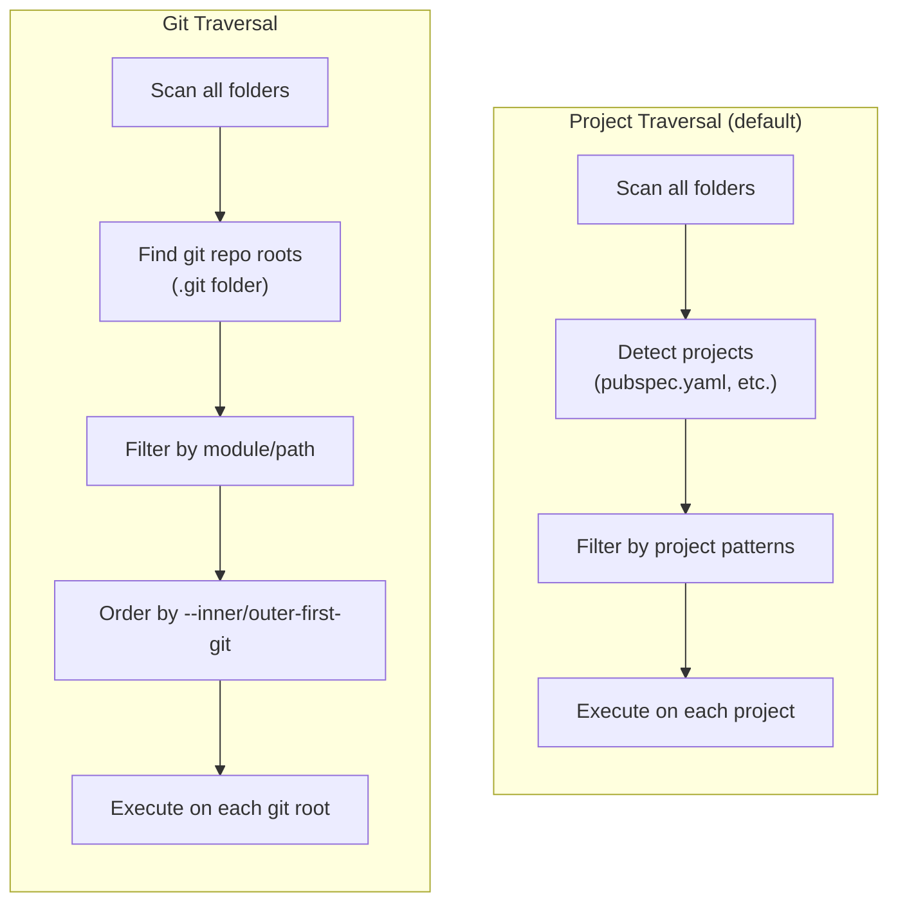

#### When to Use Git Traversal

| Traversal | Use Case | Filter Support |
|-----------|----------|----------------|
| **Project** | Build, test, analyze individual projects | `--project`, `--exclude-projects`, `--test` |
| **Git** | Git operations across repos (commit, push, status) | `--modules`, `--skip-modules`, `--exclude` (path) |

**Key differences:**

1. **Target folders** — Git traversal visits git repository roots only (folders with `.git`); project traversal visits any folder matching project natures.

2. **Available filters** — Git traversal supports `--modules`, `--skip-modules`, and `--exclude` (path patterns), but NOT `--project`, `--exclude-projects`, or `--test` (these filter by project nature, which doesn't apply to git repos).

3. **Ordering requirement** — Git traversal commands must specify either `--inner-first-git` or `--outer-first-git` to determine traversal order.

#### Command Git Traversal Properties

Commands declare their git traversal support in `CommandDefinition`:

```dart
class CommandDefinition {
  // ...
  
  /// Whether this command operates on git repos instead of projects.
  final bool isGitCommand;
  
  /// Default git traversal order (null = no default, must be specified).
  /// Only meaningful when isGitCommand is true.
  final GitTraversalOrder? defaultGitOrder;
}

enum GitTraversalOrder { innerFirst, outerFirst }
```

#### Git Traversal Validation Rules

When invoking a multi-command tool, the framework validates git traversal compatibility:

1. **No mixing** — All commands must have the same `isGitCommand` value. Error if some are git commands and others are not:
   ```
   Error: Cannot mix git commands and project commands in one invocation.
   Git commands: :commit, :push
   Project commands: :compile, :test
   ```

2. **Consistent defaults** — If multiple git commands have `defaultGitOrder` set, they must agree:
   ```
   Error: Conflicting default git order.
   :commit defaults to innerFirst
   :push defaults to outerFirst
   Specify --inner-first-git or --outer-first-git explicitly.
   ```

3. **Order required** — If any git command has `defaultGitOrder == null`, a global `--inner-first-git` or `--outer-first-git` must be specified:
   ```
   Error: Git traversal order required.
   :gitstatus requires --inner-first-git or --outer-first-git.
   ```

#### Module Filter in Git Traversal

The `--modules` and `--skip-modules` options filter by **git submodule**. In a workspace with multiple git submodules:

```
workspace/
├── .git/                          # Main repo
├── xternal/
│   ├── tom_module_basics/
│   │   └── .git/                  # Submodule: basics
│   ├── tom_module_d4rt/
│   │   └── .git/                  # Submodule: d4rt
│   └── tom_module_crypto/
│       └── .git/                  # Submodule: crypto
```

```bash
# Only process the basics and d4rt submodules
buildkit -s . -r --modules=basics,d4rt :gitstatus

# Process all except crypto
buildkit -s . -r --skip-modules=crypto :commit :push
```

#### Example: Git Command Definitions

```dart
final commitCommand = CommandDefinition(
  name: 'commit',
  description: 'Commit changes across git repos',
  isGitCommand: true,
  defaultGitOrder: GitTraversalOrder.innerFirst,  // Commit inner repos first
  requiredNatures: {GitFolder},
  // ...
);

final pushCommand = CommandDefinition(
  name: 'push',
  description: 'Push changes across git repos',
  isGitCommand: true,
  defaultGitOrder: GitTraversalOrder.outerFirst,  // Push outer repos first
  requiredNatures: {GitFolder},
  // ...
);

final gitStatusCommand = CommandDefinition(
  name: 'gitstatus',
  description: 'Show git status across repos',
  isGitCommand: true,
  defaultGitOrder: null,  // Works with either order, but must be specified
  requiredNatures: {GitFolder},
  // ...
);
```

---

## Folder Natures

### FsFolder and RunFolder

Two classes represent folders at different stages:

```dart
/// Represents a filesystem folder during scanning.
/// Minimal information — just the path and basic stats.
class FsFolder {
  final String path;
  
  String get name => p.basename(path);
  bool get exists => Directory(path).existsSync();
}

/// Represents a folder during execution with detected capabilities.
/// Base class for specific folder types (natures).
abstract class RunFolder {
  final FsFolder fsFolder;
  
  RunFolder(this.fsFolder);
  
  String get path => fsFolder.path;
  String get name => fsFolder.name;
}
```

### Nature Types

A folder can have multiple natures simultaneously:

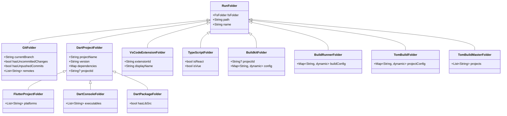

### Detection Rules

| Nature | Detection |
|--------|-----------|
| **Standard Natures** | |
| `GitFolder` | `.git/` directory or `.git` file exists |
| `DartProjectFolder` | `pubspec.yaml` exists |
| `FlutterProjectFolder` | `pubspec.yaml` contains `sdk: flutter` |
| `DartConsoleFolder` | `pubspec.yaml` exists AND `bin/` exists |
| `DartPackageFolder` | `pubspec.yaml` exists AND `lib/src/` exists |
| `VsCodeExtensionFolder` | `package.json` contains `engines.vscode` |
| `TypeScriptFolder` | `tsconfig.json` exists |
| `JavaFolder` | `pom.xml` or `build.gradle` exists |
| `PythonFolder` | `pyproject.toml`, `setup.py`, or `setup.cfg` exists |
| **Tom Framework Natures** | |
| `BuildkitFolder` | `buildkit.yaml` exists (also extracts `project-id`) |
| `BuildRunnerFolder` | `build.yaml` exists (Dart build_runner config) |
| `TomBuildFolder` | `tom_project.yaml` exists |
| `TomBuildMasterFolder` | `tom_master.yaml` exists |

**Note:** `buildkit_master.yaml` is treated as a skip marker during scan phase (see Phase 3), not as a nature. This prevents accidentally entering nested buildkit workspaces.

### CommandContext API

Commands receive a context with all detected natures:

```dart
class CommandContext {
  final FsFolder fsFolder;
  final List<RunFolder> natures;
  final String executionRoot;
  
  /// Folder path
  String get path => fsFolder.path;
  
  /// Folder name
  String get name => fsFolder.name;
  
  /// Relative path from execution root
  String get relativePath => p.relative(path, from: executionRoot);
  
  /// Check if folder has a specific nature.
  bool hasNature<T extends RunFolder>() {
    return natures.whereType<T>().isNotEmpty;
  }
  
  /// Get a specific nature (throws if not present).
  T getNature<T extends RunFolder>() {
    final matches = natures.whereType<T>();
    if (matches.isEmpty) {
      throw StateError('Folder $name does not have nature $T');
    }
    return matches.first;
  }
  
  /// Get a specific nature or null.
  T? tryGetNature<T extends RunFolder>() {
    final matches = natures.whereType<T>();
    return matches.isNotEmpty ? matches.first : null;
  }
  
  /// Check if this is a Dart project of any kind.
  bool get isDartProject => hasNature<DartProjectFolder>();
  
  /// Check if this is a git repository.
  bool get isGitRepo => hasNature<GitFolder>();
}
```

**Example usage:**

```dart
class GitStatusCommand extends Command {
  @override
  Set<Type> get requiredNatures => {GitFolder};
  
  @override
  Future<bool> execute(CommandContext ctx) async {
    final git = ctx.getNature<GitFolder>();
    
    print('Branch: ${git.currentBranch}');
    if (git.hasUncommittedChanges) {
      print('  Has uncommitted changes');
    }
    if (git.hasUnpushedCommits) {
      print('  Has unpushed commits');
    }
    
    return true;
  }
}
```

---

## Tool and Command Definitions

### ToolDefinition

```dart
class ToolDefinition {
  /// Tool name (e.g., 'buildkit', 'testkit')
  final String name;
  
  /// Short description for help header
  final String description;
  
  /// Version string (typically from version.g.dart)
  final String version;
  
  /// Tool mode
  final ToolMode mode;
  
  /// Global navigation options this tool supports
  final NavigationFeatures navigationFeatures;
  
  /// Global options (non-navigation)
  final List<OptionDefinition> globalOptions;
  
  /// Commands (for multi-command tools)
  final List<CommandDefinition> commands;
  
  /// Whether this tool supports stdin mode
  final bool supportsStdin;
  
  /// Help text for stdin mode (if supported)
  final String? stdinHelp;
  
  /// Usage patterns for help
  final List<String> usagePatterns;
  
  /// Options reserved for future use (show "not implemented" if used)
  final List<String> blockedOptions;
}

enum ToolMode {
  simple,       // Single-purpose tool
  multiCommand, // :command subcommands
  repl,         // Interactive REPL
  tui,          // Terminal UI
}
```

### CommandDefinition

```dart
class CommandDefinition {
  /// Command name (without : prefix)
  final String name;
  
  /// Short description
  final String description;
  
  /// Aliases (e.g., 'ls' for 'list')
  final List<String> aliases;
  
  /// Command-specific options
  final List<OptionDefinition> options;
  
  /// Folder natures this command operates on
  final Set<Type> requiredNatures;
  
  /// Whether command supports per-command --project/--exclude
  final bool supportsProjectFilter;
  
  /// Whether command needs workspace traversal
  final bool requiresTraversal;
  
  /// Usage examples
  final List<String> examples;
  
  /// Can this command run as a standalone executable?
  final bool canRunStandalone;
  
  /// Navigation features when run standalone (null = standard defaults)
  final NavigationFeatures? standaloneNavigation;
}
```

### OptionDefinition

```dart
class OptionDefinition {
  final String name;
  final String? abbr;
  final String description;
  final OptionType type;  // flag, option, multiOption
  final String? defaultValue;
  final List<String>? allowedValues;
  final bool mandatory;
  final bool negatable;  // for flags: --no-X
}

enum OptionType { flag, option, multiOption }
```

### Standalone Commands

A command can run as a standalone binary (separate executable). When standalone, all options are specified directly without the `:command` prefix.

```dart
// bin/cleanup.dart - standalone entry point
void main(List<String> args) async {
  final runner = StandaloneCommandRunner(
    definition: cleanupCommandDefinition,
    // When standaloneNavigation is null, use standard defaults
    navigationFeatures: cleanupCommandDefinition.standaloneNavigation 
        ?? NavigationFeatures.standard,
  );
  
  final exitCode = await runner.run(args);
  exit(exitCode);
}
```

**How standalone relates to tool:**
- A `CommandDefinition` has `canRunStandalone: true`
- When run standalone, there is NO parent tool — the command IS the entry point
- `standaloneNavigation` specifies which navigation features to enable
- If `standaloneNavigation` is null, uses `NavigationFeatures.standard` defaults
- The command gets its own `--help`, `--version` since it's the entry point
- Help text comes from `CommandDefinition`, not a parent `ToolDefinition`

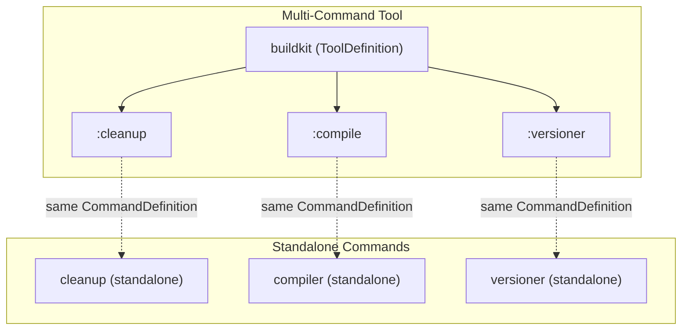

**Standalone vs multi-command execution:**

| Aspect | Multi-Command | Standalone |
|--------|---------------|------------|
| Entry point | `buildkit :cleanup` | `cleanup` |
| Help | `buildkit help :cleanup` | `cleanup --help` |
| Version | `buildkit version` | `cleanup --version` |
| Global options | From `ToolDefinition` | From `standaloneNavigation` |
| Per-command options | After `:command` | Directly |

---

## Standard CLI Features

### Version and Help

All tools support these variations:

**Version:**
```bash
mytool version
mytool --version
mytool -version
mytool -V
```

**Help:**
```bash
mytool help
mytool --help
mytool -help
mytool -h
mytool help :command    # Per-command help (multi-command tools)
mytool :command --help  # Same as above
```

### Standard Options

v2 provides these standard options automatically:

| Option | Abbr | Description |
|--------|------|-------------|
| `--verbose` | `-v` | Enable verbose output |
| `--dry-run` | `-n` | Show what would be done without doing it |
| `--list` | `-l` | List matching projects (no action) |
| `--help` | `-h` | Show help |
| `--config` | `-c` | Path to configuration file |
| `--dump-config` | | Print effective configuration |
| `--guide` | `-g` | Interactive guided mode |
| `--force` | `-f` | Skip confirmation prompts |

**Option blocking:**

If a tool doesn't support an option yet but wants to reserve it:

```dart
final tool = ToolDefinition(
  // ...
  blockedOptions: ['guide'],  // User sees "not yet implemented"
);
```

When user specifies a blocked option:
```
Error: --guide is not yet implemented for this tool.
```

### Positional Arguments

Non-option arguments after options but before `:commands`.

```bash
# REPL: positional args can be scripts or expressions
d4rt script.dart              # Execute file
d4rt "1 + 2"                  # Evaluate expression

# Simple tool: positional args are inputs
astgen source.dart            # Process specific file

# Multi-command: positional args before :commands
buildkit project.yaml :build  # Uses config file
```

**Parsing rules:**
1. Arguments before any `-` option or `:command` are positional
2. Arguments after `--` are always positional (standard convention)
3. Each tool's `ToolDefinition` specifies how many positional args it accepts

```dart
class ToolDefinition {
  /// Minimum positional arguments required
  final int minPositionalArgs;
  
  /// Maximum positional arguments allowed (-1 = unlimited)
  final int maxPositionalArgs;
  
  /// Description for positional args in help
  final String? positionalArgsHelp;
}
```

### Project IDs

Short mnemonics for projects, defined in `buildkit.yaml`:

```yaml
# In tom_build_base/buildkit.yaml
project-id: BB

# In tom_d4rt_generator/buildkit.yaml
project-id: D4G
```

**Usage:**
```bash
buildkit -p BB,D4G :compile   # Only these two projects
buildkit -x D4 :cleanup       # Exclude tom_d4rt
```

**Resolution hierarchy:**
1. Check if pattern matches a project ID
2. Check if pattern matches a project name
3. Check if pattern matches a path glob

### Test Project Modes

Control handling of `zom_*` test projects:

```bash
# Default: exclude zom_* projects
buildkit -s . -r :compile

# Include zom_* projects along with regular
buildkit -s . -r --test :compile

# Only process zom_* projects
buildkit -s . -r --test-only :compile
```

---

## API for Programmatic Use

### TraversalInfo Class

The central abstraction for traversal configuration:

```dart
/// Configuration for project traversal.
/// 
/// Can be constructed from CLI args or manually for TUI/script use.
class TraversalInfo {
  /// Starting path for scan
  final String scan;
  
  /// Whether to recurse into subdirectories
  final bool recursive;
  
  /// Execution root (workspace root)
  final String executionRoot;
  
  /// Path patterns to exclude
  final List<String> excludePatterns;
  
  /// Project names/IDs to include (empty = all)
  final List<String> projectPatterns;
  
  /// Project names to exclude
  final List<String> excludeProjects;
  
  /// Patterns to skip during recursive descent
  final List<String> recursionExclude;
  
  /// Git submodules to include (empty = all)
  final List<String> modules;
  
  /// Git submodules to exclude
  final List<String> skipModules;
  
  /// Sort by dependency order
  final bool buildOrder;
  
  /// Git traversal mode (for git-specific commands)
  final GitTraversalMode gitMode;
  
  /// Include zom_* test projects
  final bool includeTestProjects;
  
  /// Only process zom_* test projects
  final bool testProjectsOnly;
  
  /// Create from parsed CLI args
  factory TraversalInfo.fromCliArgs(CliArgs args) {
    return TraversalInfo(
      scan: args.scan ?? '.',
      recursive: args.recursive && !args.notRecursive,
      executionRoot: args.executionRoot,
      excludePatterns: args.excludePatterns,
      projectPatterns: args.projectPatterns,
      skipModules: args.skipModules,
      // ... etc
    );
  }
  
  /// Copy with modified values
  TraversalInfo copyWith({
    String? scan,
    bool? recursive,
    List<String>? projectPatterns,
    // ...
  });
}

enum GitTraversalMode { none, innerFirst, outerFirst }
```

### BuildBase.traverse() API

The main entry point for traversal:

```dart
abstract class BuildBase {
  /// Traverse projects and execute callback on each.
  /// 
  /// [info] - Traversal configuration
  /// [run] - Callback executed for each matching folder
  /// [requiredNatures] - Only process folders with these natures
  static Future<ProcessingResult> traverse({
    required TraversalInfo info,
    required Future<bool> Function(CommandContext) run,
    Set<Type>? requiredNatures,
  }) async {
    final scanner = FolderScanner();
    final filter = FilterPipeline();
    final detector = NatureDetector();
    final result = ProcessingResult();
    
    // Phase 3: Scan
    final folders = await scanner.scan(
      info.scan,
      recursive: info.recursive,
      recursionExclude: info.recursionExclude,
    );
    
    // Phase 4: Filter
    final filtered = filter.apply(folders, info);
    
    // Phase 5: Detect natures + create contexts
    final contexts = <CommandContext>[];
    for (final folder in filtered) {
      final natures = detector.detectNatures(folder);
      contexts.add(CommandContext(
        fsFolder: folder,
        natures: natures,
        executionRoot: info.executionRoot,
      ));
    }
    
    // Apply ordering
    final ordered = _applyOrdering(contexts, info);
    
    // Phase 6: Execute
    for (final ctx in ordered) {
      // Filter by required natures
      if (requiredNatures != null && requiredNatures.isNotEmpty) {
        if (!requiredNatures.every((n) => ctx.hasNature(n))) {
          continue;
        }
      }
      
      try {
        final success = await run(ctx);
        if (success) {
          result.recordSuccess(ctx.path);
        } else {
          result.recordFailure(ctx.path);
        }
      } catch (e) {
        result.recordError(ctx.path, e);
      }
    }
    
    return result;
  }
}
```

### D4rt Script Integration

Using build base from D4rt scripts requires bridging the gap between scripting convenience and full API access.

**Basic usage:**

```dart
// In a .d4rt or .dcli script
import 'package:tom_build_base/tom_build_base_v2.dart';
import 'package:dcli/dcli.dart';

void main() async {
  // Simple traversal
  await BuildBase.traverse(
    info: TraversalInfo(
      scan: '.',
      recursive: true,
      projectPatterns: ['tom_*'],
      executionRoot: pwd,
    ),
    run: (ctx) async {
      print('Processing: ${ctx.relativePath}');
      
      if (ctx.isDartProject) {
        // Use dcli to run commands
        'dart analyze'.start(workingDirectory: ctx.path);
      }
      
      return true;
    },
  );
}
```

**Convenience extensions for scripting:**

```dart
/// Extensions to make BuildBase easier to use in scripts.
extension BuildBaseScripting on BuildBase {
  /// Quick traversal with sensible defaults for scripts.
  /// 
  /// Example:
  /// ```dart
  /// await BuildBase.forEachDartProject((ctx) async {
  ///   print('${ctx.name}: ${ctx.getNature<DartProjectFolder>().version}');
  /// });
  /// ```
  static Future<ProcessingResult> forEachDartProject(
    Future<void> Function(CommandContext) action, {
    String scan = '.',
    bool recursive = true,
    List<String>? include,
    List<String>? exclude,
  }) async {
    return await BuildBase.traverse(
      info: TraversalInfo(
        scan: scan,
        recursive: recursive,
        projectPatterns: include ?? [],
        excludeProjects: exclude ?? [],
        executionRoot: Directory.current.path,
      ),
      requiredNatures: {DartProjectFolder},
      run: (ctx) async {
        await action(ctx);
        return true;
      },
    );
  }
  
  /// Quick traversal for git repositories.
  static Future<ProcessingResult> forEachGitRepo(
    Future<void> Function(CommandContext) action, {
    String scan = '.',
    bool innerFirst = true,
  }) async {
    return await BuildBase.traverse(
      info: TraversalInfo(
        scan: scan,
        recursive: true,
        gitMode: innerFirst 
            ? GitTraversalMode.innerFirst 
            : GitTraversalMode.outerFirst,
        executionRoot: Directory.current.path,
      ),
      requiredNatures: {GitFolder},
      run: (ctx) async {
        await action(ctx);
        return true;
      },
    );
  }
  
  /// Get list of projects without executing anything.
  /// 
  /// Useful for scripts that need to iterate manually.
  static Future<List<CommandContext>> findProjects({
    String scan = '.',
    bool recursive = true,
    List<String>? include,
    List<String>? exclude,
    Set<Type>? requiredNatures,
  }) async {
    final info = TraversalInfo(
      scan: scan,
      recursive: recursive,
      projectPatterns: include ?? [],
      excludeProjects: exclude ?? [],
      executionRoot: Directory.current.path,
    );
    
    final scanner = FolderScanner();
    final filter = FilterPipeline();
    final detector = NatureDetector();
    
    final folders = await scanner.scan(
      info.scan,
      recursive: info.recursive,
      recursionExclude: info.recursionExclude,
    );
    
    final filtered = filter.apply(folders, info);
    
    final contexts = <CommandContext>[];
    for (final folder in filtered) {
      final natures = detector.detectNatures(folder);
      final ctx = CommandContext(
        fsFolder: folder,
        natures: natures,
        executionRoot: info.executionRoot,
      );
      
      if (requiredNatures == null || 
          requiredNatures.every((n) => ctx.hasNature(n))) {
        contexts.add(ctx);
      }
    }
    
    return contexts;
  }
}
```

**Script examples:**

```dart
// List all Dart projects with their versions
final projects = await BuildBase.findProjects(
  requiredNatures: {DartProjectFolder},
);
for (final ctx in projects) {
  final dart = ctx.getNature<DartProjectFolder>();
  print('${dart.projectName} v${dart.version}');
}

// Run dart analyze on selected projects
await BuildBase.forEachDartProject(
  (ctx) async {
    print('Analyzing ${ctx.name}...');
    final result = 'dart analyze'.start(
      workingDirectory: ctx.path,
      nothrow: true,
    );
    if (result.exitCode != 0) {
      print('  FAILED');
    }
  },
  include: ['tom_*'],
  exclude: ['tom_test_*'],
);

// Git status across all repos
await BuildBase.forEachGitRepo((ctx) async {
  final git = ctx.getNature<GitFolder>();
  if (git.hasUncommittedChanges) {
    print('${ctx.name}: uncommitted changes on ${git.currentBranch}');
  }
});
```

### TUI Integration

TUI applications construct `TraversalInfo` from user selections rather than command-line arguments.

**Pattern:**

```dart
class MyTuiApp {
  String _selectedPath = '.';
  bool _recursive = true;
  List<String> _selectedProjects = [];
  List<String> _excludedProjects = [];
  
  /// Current traversal config based on UI state
  TraversalInfo get _currentTraversal => TraversalInfo(
    scan: _selectedPath,
    recursive: _recursive,
    projectPatterns: _selectedProjects,
    excludeProjects: _excludedProjects,
    executionRoot: _workspaceRoot,
  );
  
  /// User changed a setting — refresh project list
  void _onSettingsChanged() {
    // Re-scan with current settings to show preview
    _refreshProjectList();
  }
  
  Future<void> _refreshProjectList() async {
    final contexts = await BuildBase.findProjects(
      scan: _selectedPath,
      recursive: _recursive,
      include: _selectedProjects.isEmpty ? null : _selectedProjects,
      exclude: _excludedProjects.isEmpty ? null : _excludedProjects,
    );
    
    _updateProjectListPanel(contexts);
  }
  
  /// Execute a command with current traversal settings
  Future<void> _runCommand(Command command) async {
    final result = await BuildBase.traverse(
      info: _currentTraversal,
      requiredNatures: command.requiredNatures,
      run: (ctx) async {
        _outputPanel.appendLine('Processing: ${ctx.relativePath}');
        return await command.execute(ctx);
      },
    );
    
    _showResultsSummary(result);
  }
  
  /// User can trigger multiple traversals with different settings
  Future<void> _runOnSubset(List<String> specificProjects) async {
    final customInfo = _currentTraversal.copyWith(
      projectPatterns: specificProjects,
    );
    
    await BuildBase.traverse(
      info: customInfo,
      run: (ctx) async {
        // ...
      },
    );
  }
}
```

**Key insight:** The TUI can:
1. Use `BuildBase.findProjects()` to preview what would be selected
2. Modify `TraversalInfo` based on user interaction
3. Call `BuildBase.traverse()` multiple times with different settings
4. Use `copyWith()` to create variations of the current config

---

## Library Integration

### Core Dependencies

| Package | Purpose | Integration |
|---------|---------|-------------|
| **args** | Argument parsing | Foundation of `CliArgParser` |
| **path** | Path manipulation | Used throughout |
| **glob** | Pattern matching | Filter implementation |
| **yaml** | Config loading | `buildkit.yaml` parsing |

These are direct dependencies of tom_build_base.

### Interactive Libraries

| Package | Purpose | Current Usage | Integration |
|---------|---------|---------------|-------------|
| **interact** | Terminal prompts | Guide mode in buildkit git tools | Shared `GuidedMode` wrapper |
| **utopia_tui** | Full-screen TUI | testkit `--tui` | TUI support utilities |
| **dcli** | Shell scripting | D4rt scripts, shell commands | Script convenience methods |

**interact integration (guide mode):**

```dart
/// Shared guide mode utilities wrapping interact package.
/// 
/// Available to tools when --guide is specified.
class GuidedMode {
  /// Single-select menu. Returns selected index, -1 if cancelled.
  int menu(String prompt, List<String> options, {int defaultIndex = 0});
  
  /// Multi-select with checkboxes. Returns list of selected indices.
  List<int> multiSelect(String prompt, List<String> options);
  
  /// Yes/no confirmation.
  bool confirm(String prompt, {bool defaultYes = true});
  
  /// Text input with optional validation.
  String input(String prompt, {String? defaultValue});
  
  /// Password input (hidden).
  String password(String prompt);
  
  /// Spinner while async operation runs.
  Future<T> withSpinner<T>(String message, Future<T> Function() action);
}

// Tools can use GuidedMode when --guide is active:
if (args.guide) {
  final guided = GuidedMode();
  final projectIndex = guided.menu(
    'Select project:',
    availableProjects.map((p) => p.name).toList(),
  );
  if (projectIndex < 0) {
    print('Cancelled');
    return;
  }
  // Continue with selection
}
```

**utopia_tui integration:**

TUI applications use utopia_tui directly. tom_build_base provides:
- `TraversalInfo` and `BuildBase` APIs that work from TUI context
- No additional wrapper needed — utopia_tui handles rendering

### Output and Formatting

| Package | Purpose | Current Usage |
|---------|---------|---------------|
| **console_markdown** | ANSI markdown rendering | REPL help/output, CLI help |
| **marked** | Markdown parsing | Document processing |

**console_markdown for help text:**

```dart
void printHelp() {
  final help = '''
**MyTool** - Does useful things

<cyan>**Usage**</cyan>
  mytool [options]

<yellow>**Options**</yellow>
  -v, --verbose    Enable verbose output
  -g, --guide      Interactive guided mode
''';
  
  // Renders markdown with ANSI colors
  print(ConsoleMarkdown.render(help));
}
```

tom_build_base can provide:
- `HelpGenerator` that uses console_markdown for consistent formatting
- Standard help templates with markdown styling

### Shell Completion

Shell completion enables **tab-completion** in your terminal when typing commands. When you press Tab, the shell suggests possible completions for what you're typing.

| Package | Purpose | Status |
|---------|---------|--------|
| **completion** | Shell completions | Planned integration |

#### What Tab-Completion Provides

When installed, shell completion enables pressing `<Tab>` to auto-complete:

1. **Command names** — Type `buildkit :cl<Tab>` → completes to `buildkit :cleanup`
2. **Option names** — Type `buildkit --ver<Tab>` → completes to `buildkit --verbose`
3. **Option values** — Type `buildkit --config <Tab>` → shows `.yaml` files
4. **Project names/IDs** — Type `buildkit -p tom_<Tab>` → shows matching projects
5. **File/directory paths** — Type `buildkit -s ./ex<Tab>` → completes paths

**Example session:**

```bash
$ buildkit :c<Tab>
:cleanup    :compile    :commit

$ buildkit :compile --<Tab>
--config           --dry-run          --exclude
--force            --guide            --help
--project          --recursive        --verbose

$ buildkit -p <Tab>
BB          D4G         tom_build_base    tom_d4rt    tom_test_kit

$ buildkit -s ./ext<Tab>
$ buildkit -s ./xternal/
```

#### Installation

Shell completions require a one-time setup per tool. The tool generates a completion script that you install in your shell's completion directory:

```bash
# Bash (most Linux systems)
mytool --completion bash > ~/.bash_completion.d/mytool
# Or for systems using /etc/bash_completion.d/
sudo mytool --completion bash > /etc/bash_completion.d/mytool

# Zsh (macOS default, many Linux)
mytool --completion zsh > ~/.zsh/completions/_mytool
# Make sure your .zshrc includes: fpath=(~/.zsh/completions $fpath)

# Fish shell
mytool --completion fish > ~/.config/fish/completions/mytool.fish
```

After installation, **restart your shell** or source the completion script:
```bash
source ~/.bash_completion.d/mytool   # Bash
source ~/.zsh/completions/_mytool    # Zsh
```

#### How It Works

When you press `<Tab>`, the shell runs your tool with a special environment variable asking "what completions are available for this input?" The tool returns possible completions based on:

1. **Static completions** — Command names and options from `ToolDefinition`
2. **Dynamic completions** — Project names/IDs discovered by scanning the workspace

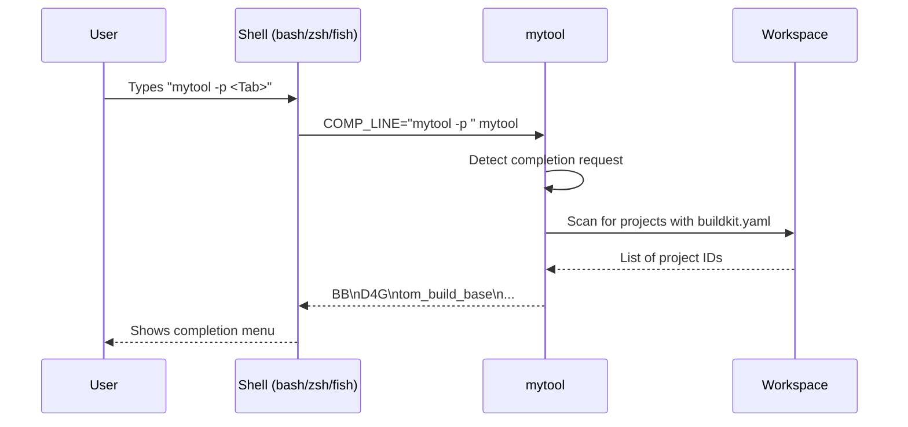

#### Implementation

```dart
class CompletionGenerator {
  final ToolDefinition tool;
  
  /// Generate completion script for specified shell.
  String generate(Shell shell) {
    switch (shell) {
      case Shell.bash:
        return _generateBash();
      case Shell.zsh:
        return _generateZsh();
      case Shell.fish:
        return _generateFish();
    }
  }
  
  String _generateBash() {
    // Generate bash completion script from ToolDefinition:
    // - All commands and their aliases
    // - All options (global and per-command)
    // - Custom completion functions for dynamic values
  }
}

/// Handle completion request at runtime.
class CompletionHandler {
  /// Called when tool is invoked with completion environment variables.
  List<String> getCompletions(String partialInput, int cursorPosition) {
    final words = partialInput.split(' ');
    final currentWord = _getCurrentWord(words, cursorPosition);
    
    if (currentWord.startsWith(':')) {
      // Complete command names
      return _matchCommands(currentWord);
    } else if (currentWord.startsWith('-')) {
      // Complete option names
      return _matchOptions(currentWord);
    } else if (_isPreviousOptionWithValue(words)) {
      // Complete option value (files, projects, etc.)
      return _matchOptionValue(words);
    } else {
      // Complete file/directory paths
      return _matchPaths(currentWord);
    }
  }
  
  List<String> _matchProjects(String partial) {
    // Scan workspace for projects with buildkit.yaml
    // Return matching project names and IDs
  }
}
```

**Dynamic project completion:**

For `-p` / `--project` options, the completion handler scans the workspace to find projects with `buildkit.yaml` files and returns both project names and project IDs as completion candidates.

---

## Migration Strategy

### v2 Source Structure

v2 code lives alongside v1 to allow gradual migration:

```
tom_build_base/
├── lib/
│   ├── tom_build_base.dart           # v1 barrel (unchanged)
│   ├── tom_build_base_v2.dart        # v2 barrel (new)
│   └── src/
│       ├── build_config.dart         # v1
│       ├── project_navigator.dart    # v1
│       ├── ... (other v1 files)
│       │
│       └── v2/
│           ├── core/
│           │   ├── tool_definition.dart
│           │   ├── command_definition.dart
│           │   ├── option_definition.dart
│           │   └── cli_args.dart
│           ├── traversal/
│           │   ├── traversal_info.dart
│           │   ├── build_base.dart
│           │   ├── folder_scanner.dart
│           │   ├── filter_pipeline.dart
│           │   └── nature_detector.dart
│           ├── folder/
│           │   ├── fs_folder.dart
│           │   ├── run_folder.dart
│           │   ├── command_context.dart
│           │   └── natures/
│           │       ├── git_folder.dart
│           │       ├── dart_project_folder.dart
│           │       └── ...
│           ├── runner/
│           │   ├── tool_runner.dart
│           │   ├── command_executor.dart
│           │   └── help_generator.dart
│           ├── interactive/
│           │   ├── guided_mode.dart
│           │   └── completion_generator.dart
│           └── scripting/
│               └── build_base_extensions.dart
```

### Migration Path

| Phase | Duration | Deliverables |
|-------|----------|--------------|
| **Phase 1** | 1 week | `TraversalInfo`, `BuildBase.traverse()`, `FsFolder`/`RunFolder` |
| **Phase 2** | 1 week | `ToolDefinition`, `CommandDefinition`, help generation |
| **Phase 3** | 2 days | Migrate `cleanup` tool as proof of concept |
| **Phase 4** | 1 week | Migrate `testkit`, including TUI updates |
| **Phase 5** | 3 days | D4rt scripting extensions, documentation |
| **Phase 6** | Ongoing | Migrate remaining tools, shell completion |

### Backward Compatibility

- v1 API remains fully functional
- Tools can mix v1 and v2 imports during migration
- v2 classes can wrap v1 utilities where needed
- No breaking changes to existing tools

---

## Implementation Phases

### Phase 1: Core Infrastructure

**Goal:** Enable basic programmatic traversal.

**Deliverables:**
- `TraversalInfo` class with all configuration
- `FsFolder` and `RunFolder` base classes
- `FolderScanner` for filesystem walking
- `FilterPipeline` for applying filters
- `NatureDetector` for detecting folder types
- `BuildBase.traverse()` static method
- Core nature classes: `GitFolder`, `DartProjectFolder`, subclasses

### Phase 2: Tool Framework

**Goal:** Enable declarative tool definitions.

**Deliverables:**
- `ToolDefinition`, `CommandDefinition`, `OptionDefinition`
- `CliArgParser` for argument parsing
- `HelpGenerator` for automatic help text
- `ToolRunner` for executing tools
- `CommandExecutor` for executing commands

### Phase 3: Proof of Concept

**Goal:** Validate v2 works in practice.

**Deliverables:**
- Migrate `cleanup` tool to v2
- Document any issues or API adjustments
- Performance comparison with v1

### Phase 4: Multi-Command Migration

**Goal:** Support complex tools.

**Deliverables:**
- Migrate `testkit` including TUI mode
- Validate per-command filtering
- Validate TUI integration with `BuildBase`

### Phase 5: Scripting Support

**Goal:** Enable D4rt script usage.

**Deliverables:**
- `BuildBase.forEachDartProject()` convenience method
- `BuildBase.forEachGitRepo()` convenience method
- `BuildBase.findProjects()` for listing
- Documentation and examples

### Phase 6: Polish

**Goal:** Complete the ecosystem.

**Deliverables:**
- Shell completion generation
- Migrate remaining tools
- Performance optimization
- Comprehensive test suite

---

## Summary

tom_build_base v2 provides:

1. **Unified CLI patterns** — All tools share the same argument parsing, help generation, and option handling via `ToolDefinition` and `CommandDefinition`.

2. **Configuration-free traversal** — Comprehensive folder scanning detects project types without explicit configuration. The `NatureDetector` examines key files to determine folder types.

3. **Reusable API** — `BuildBase.traverse()` works from CLI, TUI, REPL, and D4rt scripts with the same `TraversalInfo` abstraction. The API doesn't know where its configuration came from.

4. **Flexible filtering** — Global filters, per-command filters, and nature-based filtering combine predictably. Filter order is well-defined and documented.

5. **Rich context** — Commands receive `CommandContext` with all detected folder natures, enabling type-safe access to project metadata.

6. **Gradual migration** — Separate source tree (`src/v2/`) allows tool-by-tool adoption without disruption to existing tools.

The key insight is **separating argument parsing from traversal execution**. This enables the same traversal logic to serve command-line tools, interactive TUIs, and scripted automation — with configuration coming from whichever source is appropriate for the context.

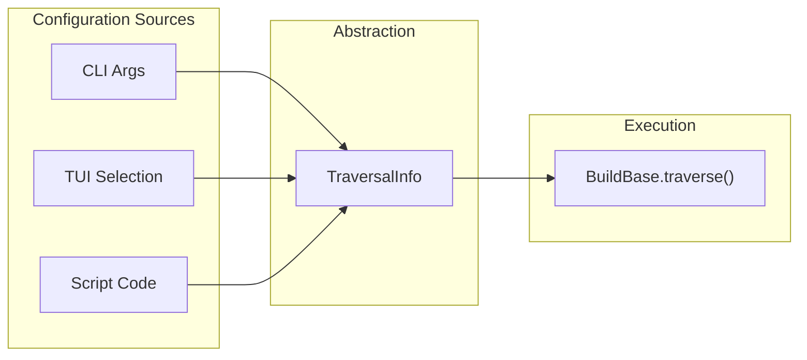
