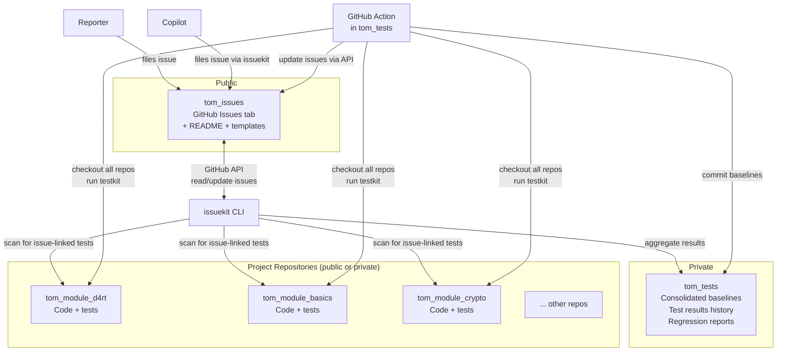
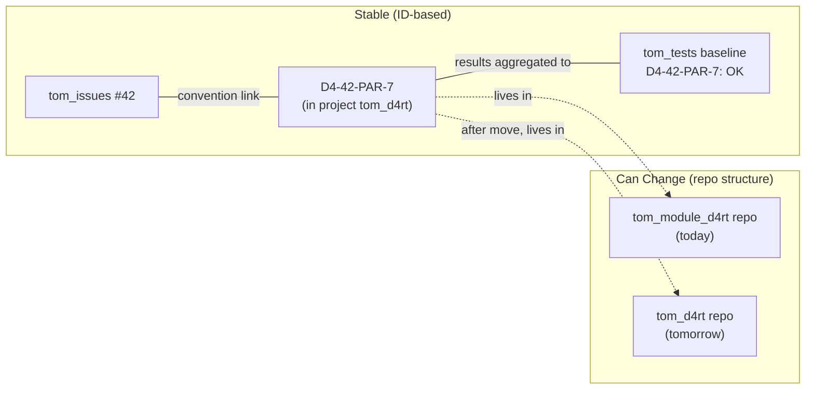
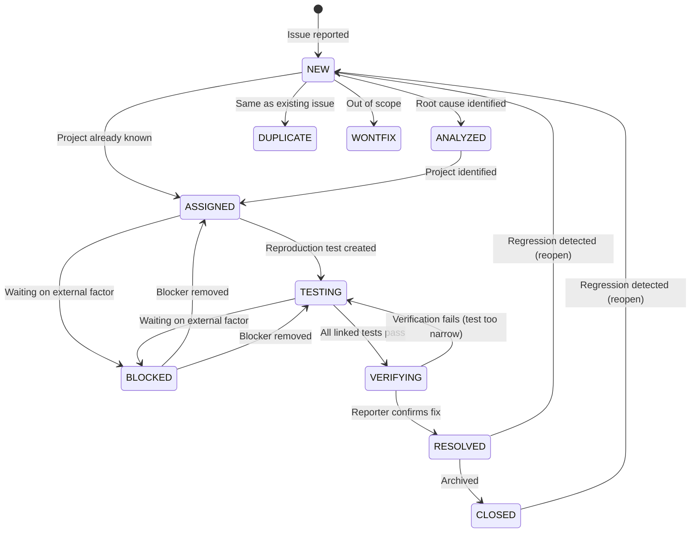
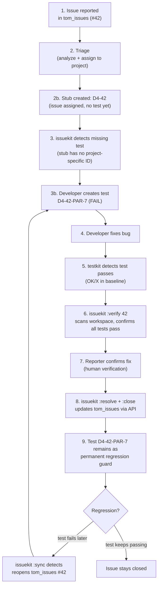
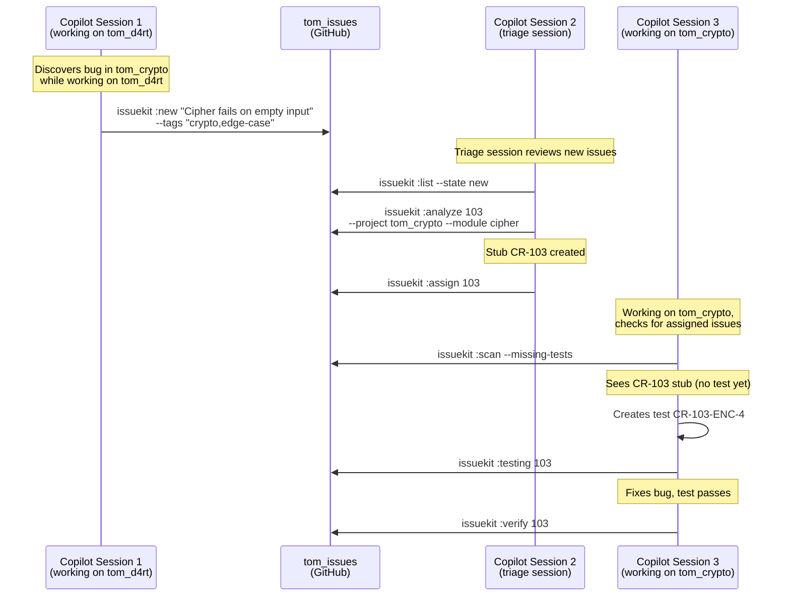
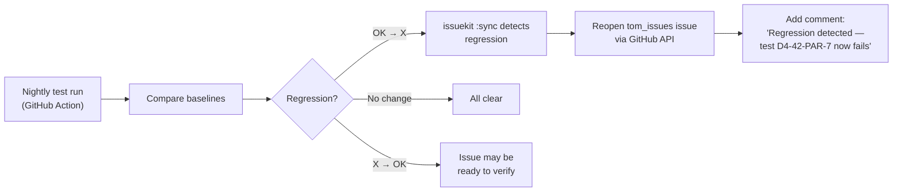
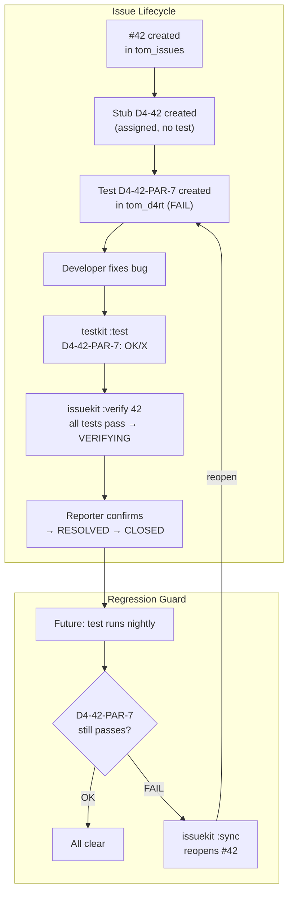

# Issue Tracking — Concept and Workflow

This document defines the issue tracking process supported by Tom Issue Kit's `issuekit` CLI. It describes the architecture of three interconnected GitHub repositories, the lifecycle of an issue from discovery through verified resolution, the ID conventions that link issues to reproduction tests via codebase scanning, automated Copilot-driven issue filing, and the commands that orchestrate the workflow.

---

## Table of Contents

1. [Overview](#overview)
2. [The Problem](#the-problem)
3. [Architecture](#architecture)
4. [Design Principles](#design-principles)
5. [ID Scheme](#id-scheme)
6. [Issue Lifecycle](#issue-lifecycle)
7. [The Issue-to-Resolution Pipeline](#the-issue-to-resolution-pipeline)
8. [Convention-Based Test Linking](#convention-based-test-linking)
9. [Copilot-Driven Issue Reporting](#copilot-driven-issue-reporting)
10. [Consolidated Test Tracking](#consolidated-test-tracking)
11. [Regression Detection and Automated Reopening](#regression-detection-and-automated-reopening)
12. [Command Reference (Quick)](#command-reference-quick)
13. [Full Command Reference](#full-command-reference)
14. [Integration with Testkit and Buildkit](#integration-with-testkit-and-buildkit)
15. [GitHub Actions — Automated Test Runs](#github-actions--automated-test-runs)
16. [Configuration](#configuration)
17. [Project Traversal](#project-traversal)

---

## Overview

`issuekit` bridges the gap between **discovering a problem** and **confirming it is fixed**. It orchestrates issue tracking across a multi-repository workspace by using GitHub Issues as the database, convention-based test linking for traceability, and automated scanning for synchronization.

The tool operates across three GitHub repositories and any number of project repositories:

| Repository | Visibility | Purpose |
|------------|-----------|---------|
| **`tom_issues`** | Public | External issue intake — reporters file issues here |
| **`tom_tests`** | Private | Consolidated test results and regression tracking |
| **Project repos** | Public or private | Contain the actual code and issue-linked tests |

Tom Issue Kit fills the space that neither `testkit` nor `buildkit` covers:

| Tool | Scope |
|------|-------|
| **testkit** | Runs tests, tracks test results over time, detects regressions |
| **buildkit** | Builds, analyzes, and manages projects |
| **issuekit** | Records discovered problems, orchestrates their lifecycle across GitHub repos, and synchronizes issue states with test results |

`testkit` tells you _what_ failed. `issuekit` tells you _why_ it matters, _where_ it belongs, _what_ to do about it, and — critically — **whether the fix actually resolved the original problem**.

---

## The Problem

In a multi-project workspace, problems surface in many ways:

- A test fails during development and the cause isn't immediately clear
- A consumer of a component reports unexpected behavior
- A developer notices incorrect output while working on something else
- Copilot discovers a bug while working on an unrelated task in another project
- A code review reveals a latent bug
- An edge case is discovered that no test covers

In all these cases, the person (or AI) who discovers the problem may not have time to fix it right now, may not know which project owns the bug, or may not be the right person to fix it. Without a lightweight way to record the issue, it gets lost — mentioned in a chat message, a mental note, or a TODO comment buried in code.

**The core requirement:** Record the issue immediately with enough context to act on it later, then track it through a defined pipeline until resolution is **verified** — not just "fixed" but confirmed that the original problem no longer occurs.

**The structural challenge:** Projects move between repositories, repositories get split or merged, but issue tracking must remain stable. The tracking system cannot be coupled to repository structure.

---

## Architecture

### The Three Repositories



### `tom_issues` — Public Issue Intake

- **Contains:** README, issue templates, possibly a `CONTRIBUTING.md` explaining how to report issues.
- **The Issues tab is the primary artifact.** Each GitHub Issue is a tracked problem report.
- **Anyone can file an issue.** This is the public-facing intake point.
- **Issue labels** map to lifecycle states (`new`, `analyzed`, `assigned`, `testing`, `verifying`, `resolved`).
- **Reporters can see** their issue's status and any cross-reference comments linking to internal work, but they cannot see the internal project issue trackers.
- **File attachments** (screenshots, logs, repro scripts) are attached directly to the GitHub Issue — no need for separate storage.

### `tom_tests` — Consolidated Test View

- **Contains:** Aggregated baseline CSVs, consolidated test result reports, regression history.
- **No test code.** Tests live in their respective project repositories.
- **Purpose:** Provides a single location to see the test status of every issue-linked test across all projects and repositories.
- **GitHub Action runs here** — checks out the full workspace, runs all tests via testkit, commits results back.
- **Regression detection:** By comparing baselines over time, issuekit detects when previously passing tests start failing and can automatically reopen the corresponding `tom_issues` issue.

### Project Repositories

- **Contain:** The actual code and the issue-linked tests.
- **Tests use the `<PROJECT_ID>-<issue-number>-<project-specific-ids>` naming convention** to link back to `tom_issues` issues.
- **Issue trackers on project repos are for internal use only.** On public repos, Issues can be disabled or gated to collaborators.
- **Projects are identified by Project ID**, not by repository. When a project moves between repos, its tests and Project ID move with it. The consolidated view in `tom_tests` remains valid.

### Why This Separation Matters

The Project ID is the stable anchor — not the repository path. If `tom_d4rt` moves from `tom_module_d4rt` to its own repo, the test `D4-42-PAR-7` still has the same ID. The consolidated view in `tom_tests` doesn't break because it never referenced the repo — only the Project ID.



---

## Design Principles

### 1. GitHub as the Issue Database

Issues are stored as GitHub Issues in the `tom_issues` repository. There is no local database. This gives us:
- A web UI for free (GitHub Issues interface)
- API access for automation (REST and GraphQL)
- Notifications, @mentions, cross-repo references
- File attachments on issues (screenshots, logs)
- Visibility control (public intake, private internal trackers)

### 2. Codebase as Source of Truth for Test Linking

The primary linking mechanism between issues and reproduction tests is the **test description in source code**, not a database. By embedding the issue ID in the test's ID using a naming convention, we can **scan the codebase** to discover all tests related to any issue — across all projects and repositories.

This eliminates synchronization problems: there is no link record that can get out of date. The test code IS the link.

### 3. Convention Over Configuration

Issue-to-test linking works through ID conventions, not explicit registration. When a developer writes a reproduction test with the correct ID format, issuekit can discover it automatically.

### 4. Verified Resolution

An issue is not resolved just because someone says "I fixed it." Resolution requires **proof**: the reproduction test must pass. And the issue is not closed until the original reporter or a reviewer confirms that the fix addresses the **original symptom**, not just the test case.

### 5. Repository-Independent Tracking

Issues are tracked by Project ID, not by repository path. Projects can move between repositories, repositories can be split or merged, and the tracking remains intact. The `tom_tests` consolidated view never references repository paths — only Project IDs and test IDs.

### 6. Every Issue Has a Test

Every issue in a project MUST have an associated test, even if it is a symbolic test (a test that simply documents the issue exists and will be implemented). An issue in a project IS always also a test. This ensures that every issue is machine-scannable and that verification can be automated.

---

## ID Scheme

The ID scheme creates a globally unique, scannable connection between issues, projects, and tests. It extends the existing test ID convention to optionally include a `tom_issues` issue number.

### Project ID

Each project in the workspace has a short unique prefix, defined in the project's `tom_project.yaml`. Project IDs should be **as short as possible** while remaining unique and easy to remember:

| Project | Project ID |
|---------|-----------|
| `tom_d4rt` | `D4` |
| `tom_d4rt_generator` | `D4G` |
| `tom_d4rt_dcli` | `D4D` |
| `tom_build_kit` | `BK` |
| `tom_test_kit` | `TK` |
| `tom_issue_kit` | `IK` |
| `tom_crypto` | `CR` |
| `tom_basics` | `BA` |

Project IDs are uppercase, 2–4 characters. They must be unique across the workspace. Each project declares its ID:

```yaml
# tom_project.yaml
project_id: D4
```

### Issue ID

Issues are GitHub Issues in `tom_issues`. Their number is their ID — no prefix, no padding:

```
#1, #2, ..., #42, #156
```

In issuekit commands, the issue is referenced by its number:

```bash
issuekit :show 42
issuekit :verify 156
```

### Test IDs

Test IDs follow a unified convention with two forms: **issue-linked** and **regular**.

#### Regular Test IDs (no issue)

Tests created during normal development — for new features, examples, refactoring — use the existing convention:

```
<PROJECT_ID>-<project-specific-ids>
```

The `<project-specific-ids>` part is project-defined and free-form, typically using category codes and numbers. It must be **unique within the project**.

**Examples:**

```
D4-PAR-15          → tom_d4rt, parser test 15
D4-INT-GLOB-43     → tom_d4rt, integration / globals test 43
BK-BLD-3           → tom_build_kit, build test 3
CR-ENC-7           → tom_crypto, encryption test 7
```

```dart
test('D4-PAR-15: Parser handles nested objects [2026-01-15 10:00]', () { ... });
test('BK-BLD-3: Build with missing pubspec fails gracefully [2026-01-20 09:00]', () { ... });
```

#### Issue-Linked Test IDs

Tests linked to a `tom_issues` issue embed the issue number between the Project ID and the project-specific part:

```
<PROJECT_ID>-<issue-number>-<project-specific-ids>
```

| Component | Description |
|-----------|-------------|
| `<PROJECT_ID>` | Project prefix (e.g., `D4`, `BK`) |
| `<issue-number>` | The GitHub issue number from `tom_issues` |
| `<project-specific-ids>` | Project-defined test identifier — must be unique within the project |

**Examples:**

```
D4-42-PAR-7        → tom_d4rt, issue #42, parser test 7
D4-42-PAR-8        → tom_d4rt, issue #42, parser test 8
BK-42-BLD-3        → tom_build_kit, issue #42, build test 3
D4-156-INT-GLOB-43 → tom_d4rt, issue #156, integration / globals test 43
```

```dart
test('D4-42-PAR-7: Array parser crashes on empty arrays [2026-02-10 14:00] (FAIL)', () {
  final result = parseArray('[]');
  expect(result, isEmpty);
});
```

#### Test ID Promotion

A regular test can be **promoted** to an issue-linked test by inserting the issue number. Since the project-specific part is unique within the project, the test retains its identity:

```
D4-PAR-15              → regular test (no issue)
D4-42-PAR-15           → promoted: now linked to issue #42
```

This is useful when a test that was written for a feature turns out to be relevant to a reported issue. The project-specific ID (`PAR-15`) remains the same — only the issue number is inserted.

#### Issue Stub IDs

When an issue is first assigned to a project during triage, an initial stub is created with just the Project ID and issue number:

```
D4-42                  → stub: issue #42 assigned to tom_d4rt, no test yet
```

This stub has no project-specific part. issuekit detects this as a "test missing" state — the issue is assigned but no reproduction test has been created yet. During test creation, the ID is promoted:

```
D4-42                  → stub (detected as "needs test")
D4-42-PAR-7            → test created (stub promoted to full test ID)
```

#### Uniqueness Rules

- The `<project-specific-ids>` part must be **unique within the project**, regardless of whether an issue number is present.
- `D4-PAR-15` and `D4-42-PAR-15` refer to the same conceptual test (PAR-15 in D4) — one is just issue-linked. They should not both exist simultaneously; promotion replaces the old ID.
- issuekit provides a `:validate` command to check test ID uniqueness across the workspace.

### Why This Matters

Given issue `#42`, we can find **every reproduction test in the entire workspace** by scanning test files for the pattern `<PROJECT_ID>-42-` in test descriptions:

```
tom_d4rt/test/parser/array_parser_test.dart       → D4-42-PAR-7
tom_d4rt/test/parser/array_null_test.dart          → D4-42-PAR-8
tom_build_kit/test/build/edge_cases_test.dart      → BK-42-BLD-3
```

No database. No link records. The codebase is the source of truth.

---

## Issue Lifecycle

An issue moves through the following lifecycle:



### States

| State | Meaning | Entry Condition | Exit Criteria |
|-------|---------|-----------------|---------------|
| **NEW** | Issue discovered and recorded in `tom_issues` | Issue filed (by reporter or Copilot) | Symptom and context provided |
| **ANALYZED** | Root cause identified or narrowed down | Root cause determined | Affected project identified |
| **ASSIGNED** | Ownership clear — belongs to a specific project. Stub test ID (`D4-42`) generated. | Project identified | Developer can act on it |
| **TESTING** | Full reproduction test exists in the target project (stub promoted to `D4-42-PAR-7`) | Test created with `(FAIL)` expectation | Developer works on fix |
| **VERIFYING** | Fix applied — reproduction test now passes | All linked tests pass | Original reporter confirms fix addresses the symptom |
| **RESOLVED** | Original issue confirmed fixed | Reporter confirms the original symptom is gone | Awaiting archival |
| **CLOSED** | Archived | Issue closed after resolution | N/A |

**Key distinction between VERIFYING and RESOLVED:**

- **VERIFYING** = "The test passes" — the code fix works. But does it actually solve the original problem as the reporter experienced it? The reproduction test may be too narrow, or the fix may only address part of the issue.
- **RESOLVED** = "The original problem is gone" — confirmed by the reporter, reviewer, or by passing a broader acceptance test.

### Additional States

| State | Meaning |
|-------|---------|
| **BLOCKED** | Cannot proceed — waiting on external factor (dependency, information, decision) |
| **DUPLICATE** | Same root cause as another issue — linked to original |
| **WONTFIX** | Intentional behavior or out of scope — documented and closed |

---

## The Issue-to-Resolution Pipeline

This is the complete workflow from problem discovery to confirmed resolution.



### Step 1: Record the Issue (→ NEW)

Someone discovers a problem. They file it in `tom_issues` (via GitHub UI) or via issuekit:

```bash
issuekit :new "JSON parser crashes on empty arrays" \
  --severity high \
  --context "Discovered while running tom_d4rt tests, test D4-PAR-12 fails with RangeError" \
  --expected "Empty arrays should parse to an empty list" \
  --tags "parser,json,crash"
```

issuekit creates GitHub Issue `#42` in `tom_issues` via the API, applying appropriate labels.

### Step 2: Triage — Analyze and Assign (→ ANALYZED → ASSIGNED)

Triage determines the root cause and which project owns it:

```bash
issuekit :analyze 42 \
  --root-cause "Array parser does not handle length-0 case in _parseArrayElements()" \
  --project tom_d4rt \
  --module parser
```

When the issue is assigned to a project, issuekit creates a **stub test ID** in the issue metadata:

```
D4-42    → tom_d4rt, issue #42 (no project-specific test ID yet)
```

issuekit updates the GitHub Issue with labels (`assigned`, `project:D4`) and adds a comment with the analysis and stub ID.

### Step 3: Detect Missing Test and Create Reproduction Test (→ TESTING)

issuekit can detect issues that are assigned but have no full test yet (stubs without a project-specific part):

```bash
issuekit :scan --missing-tests
```

Output:
```
Issues with missing tests:

Issue   Project   Stub ID   State      Title
------  --------  --------  ---------  -----
#42     D4        D4-42     ASSIGNED   Array parser crashes on empty arrays
#103    CR        CR-103    ASSIGNED   Cipher fails on empty input
```

The developer (or Copilot) creates a reproduction test in the target project, promoting the stub to a full test ID:

```dart
test('D4-42-PAR-7: Array parser crashes on empty arrays [2026-02-10 14:00] (FAIL)', () {
  final result = parseArray('[]');
  expect(result, isEmpty);
});
```

The issue transitions to `TESTING` when issuekit detects a test matching issue `#42` in the codebase:

```bash
issuekit :testing 42
```

issuekit verifies that a full test ID (not just a stub) exists, updates the GitHub Issue label to `testing`, and adds a comment noting which tests were found.

**Multiple tests per issue:** One issue can spawn multiple tests, potentially across projects:

```dart
// In tom_d4rt — tests the parser directly
test('D4-42-PAR-7: Array parser crashes on empty arrays [2026-02-10 14:00] (FAIL)', ...);

// In tom_d4rt — tests a related edge case
test('D4-42-PAR-8: Array parser crashes on null elements [2026-02-10 14:00] (FAIL)', ...);

// In tom_build_kit — tests that build handles the parser error gracefully
test('BK-42-BLD-12: Build recovers from parser crash on empty arrays [2026-02-10 15:00] (FAIL)', ...);
```

All three are discoverable by scanning for `-42-` in test IDs prefixed by a known Project ID.

### Step 4: Fix the Bug

The developer fixes the bug in the target project:

```bash
testkit :test -c "fixed empty array parsing"
```

If the reproduction test now passes, testkit shows it as `OK/X` (passed unexpectedly — progress!).

### Step 5: Verify the Fix (→ VERIFYING)

```bash
issuekit :verify 42
```

The `:verify` command:
1. Scans the workspace for all tests linked to issue `#42`
2. Checks testkit baselines in each relevant project
3. If **all pass**, updates the GitHub Issue label to `verifying`
4. If any test still fails, reports which ones

### Step 6: Confirm Resolution (→ RESOLVED)

Once the reporter or reviewer confirms the fix:

```bash
issuekit :resolve 42 --fix "Added empty check in ArrayParser._parseArrayElements()"
```

The developer updates the test expectation from `(FAIL)` to `(PASS)` or removes it:

```dart
test('D4-42-PAR-7: Array parser crashes on empty arrays [2026-02-10 14:00]', ...);
```

Now testkit tracks it as `OK/OK` — a healthy test. Any future regression will show as `X/OK`.

### Step 7: Close the Issue (→ CLOSED)

```bash
issuekit :close 42
```

issuekit closes the GitHub Issue via the API and adds a resolution summary comment. The reproduction test **remains in the codebase permanently** as a regression guard.

---

## Convention-Based Test Linking

This is the key mechanism that connects issues to tests without maintaining a database of links.

### How It Works

1. **Assign an issue** to a project → issuekit records a stub (`D4-42`)
2. **Create the test** with an issue-linked ID: `D4-42-PAR-7`
3. **issuekit discovers it** by scanning `test/` directories across the workspace for `<PROJECT_ID>-<issue-number>-` patterns in test descriptions
4. **testkit tracks it** as a normal test — the ID format is transparent to testkit
5. **issuekit reads testkit baselines** to check if linked tests pass or fail
6. **issuekit updates GitHub Issues** in `tom_issues` based on test results

### Scanning

The `:scan` command discovers all tests for an issue:

```bash
issuekit :scan 42
```

Output:
```
Tests for issue #42 (tom_issues):

Project       Test ID         File                                    Line  Status
-----------   -------------   ------------------------------------    ----  ------
tom_d4rt      D4-42-PAR-7     test/parser/array_parser_test.dart      45    FAIL
tom_d4rt      D4-42-PAR-8     test/parser/array_null_test.dart        12    FAIL
tom_build_kit BK-42-BLD-12    test/build/edge_cases_test.dart         88    PASS
```

Other scanning modes:

```bash
issuekit :scan                         # All issue-linked tests
issuekit :scan --project tom_d4rt      # Only in tom_d4rt
issuekit :scan --state testing         # Only for issues in TESTING state
issuekit :scan --missing-tests         # Issues assigned but without full tests
```

### Test Promotion

Existing tests can be promoted to issue-linked tests when a connection is discovered:

```bash
issuekit :promote D4-PAR-15 --issue 42
```

This renames the test ID from `D4-PAR-15` to `D4-42-PAR-15` in the source file. The project-specific part (`PAR-15`) stays the same, preserving the test's identity in testkit baselines.

### Why Not a Database?

A database approach (stored link records) has synchronization problems:

| Problem | Database approach | Convention approach |
|---------|-------------------|---------------------|
| Test renamed/moved | Database out of date | Scan finds it wherever it is |
| Test deleted | Stale reference | Scan finds nothing — clear signal |
| New test added | Must run re-registration | Scan discovers it automatically |
| Test in wrong project | Reference to wrong location | ID prefix makes project clear |
| Multiple tests per issue | Must register each one | All discovered automatically |
| Project moves to new repo | Links break | Project ID goes with the project |

---

## Copilot-Driven Issue Reporting

### The Problem: Cross-Project Bug Discovery

Copilot often works on one project and discovers a bug in another. It cannot fix the bug immediately — it's working on something else. The bug must be recorded so it doesn't get lost.

### The Flow



### How Copilot Files an Issue

When Copilot discovers a bug in another project, it runs:

```bash
issuekit :new "Cipher fails on empty input" \
  --severity high \
  --context "Discovered while implementing D4RT bridge encryption. CipherEngine.encrypt('') throws ArgumentError instead of returning empty ciphertext." \
  --expected "Empty input should produce empty output" \
  --tags "crypto,cipher,edge-case" \
  --reporter copilot
```

This creates a GitHub Issue in `tom_issues` with the `new` label and `reporter:copilot` label.

### Triage Session

A separate Copilot session (or the developer manually) reviews new issues:

1. **List unprocessed issues:** `issuekit :list --state new`
2. **Analyze each one:** Determine root cause, identify the target project
3. **Assign:** `issuekit :assign 103 --project tom_crypto`
4. Stub `CR-103` is created. GitHub Issue gets labels (`assigned`, `project:CR`).

### Detection by the Project Copilot

When Copilot starts working on a project, it checks for work:

```bash
issuekit :scan --missing-tests --project tom_crypto
```

This reveals issues assigned to `tom_crypto` that still have only stub IDs (no full test). Copilot can then:

1. Read the issue details (symptom, context, expected behavior)
2. Investigate the bug
3. Create a reproduction test: `CR-103-ENC-4` (promoting the stub)
4. Fix the bug
5. Verify: `issuekit :verify 103`

### Issues Without Tests

When an issue is first filed, it has no test. At `ASSIGNED`, a stub exists (`CR-103`) but no project-specific test. The rule **every issue must have a full test** applies at the transition to `TESTING` — issuekit requires at least one full test ID (not just a stub) before allowing the transition.

---

## Consolidated Test Tracking

### How `tom_tests` Works

`tom_tests` is a private repository that serves as the consolidated view of all issue-linked tests across all projects. It contains no test code — only results.

```
tom_tests/
├── baselines/
│   ├── baseline_0211_0800.csv    # Full workspace baseline from Feb 11, 08:00
│   ├── baseline_0212_0800.csv    # Full workspace baseline from Feb 12, 08:00
│   └── ...
├── reports/
│   ├── regression_report.md      # Current regression status
│   └── issue_status.md           # Current issue-to-test mapping
├── config/
│   └── workspace.yaml            # Repository list, Project ID mappings
└── README.md
```

### Consolidated Baselines

A consolidated baseline merges testkit baselines from all projects into a single CSV:

```csv
Project,Test ID,Description,0211_0800,0212_0800
D4,D4-42-PAR-7,Array parser crashes on empty arrays,X,OK
D4,D4-42-PAR-8,Array parser crashes on null elements,X,OK
BK,BK-42-BLD-12,Build recovers from parser crash,OK,OK
CR,CR-103-ENC-4,Cipher fails on empty input,X,X
```

This gives a single-file view of every issue's test status across the entire workspace, with history.

### Regression Detection

By comparing consecutive baselines, regressions are immediately visible:

```
D4-42-PAR-7:  OK → X   ← REGRESSION (was fixed, now broken again)
CR-103-ENC-4: X → OK   ← FIX (was broken, now passing)
```

---

## Regression Detection and Automated Reopening

### The Regression Loop



### How `:sync` Works

The `:sync` command cross-references GitHub Issues in `tom_issues` with test results:

1. For issues in `ASSIGNED` state: scans for matching tests. If a full test (not just stub) is found, suggests `→ TESTING`.
2. For issues in `TESTING` state: checks if all tests pass. If so, suggests `→ VERIFYING`.
3. For issues in `RESOLVED` or `CLOSED` state: checks for regressions. If a linked test fails, **reopens the issue** with a comment explaining which test regressed.

This creates a fully automated feedback loop: fix a bug → test passes → issue resolves. Bug reappears → test fails → issue reopens. No manual tracking required.

---

## Command Reference (Quick)

### Issue Management

| Command | Description |
|---------|-------------|
| `:new` | Create a new issue in `tom_issues` via GitHub API |
| `:edit` | Edit an existing issue's fields |
| `:analyze` | Record analysis results (root cause, affected project) |
| `:assign` | Assign an issue to a project (creates stub test ID) |
| `:testing` | Mark that a reproduction test has been created |
| `:verify` | Check if linked tests pass — move to VERIFYING if all pass |
| `:resolve` | Confirm the original issue is fixed after verification |
| `:close` | Close and archive a resolved issue |
| `:reopen` | Reopen a closed or resolved issue |

### Discovery and Querying

| Command | Description |
|---------|-------------|
| `:list` | List issues with filtering and sorting |
| `:show` | Show full details of one issue |
| `:search` | Full-text search across all issues |
| `:scan` | Scan workspace for tests linked to issues via ID convention |
| `:summary` | Dashboard: counts by state, severity, project |

### Test Management

| Command | Description |
|---------|-------------|
| `:promote` | Promote a regular test to issue-linked (insert issue number) |
| `:validate` | Check test ID uniqueness across the workspace |

### Workflow Integration

| Command | Description |
|---------|-------------|
| `:sync` | Sync issue states with test results — detect fixes and regressions |
| `:aggregate` | Aggregate testkit baselines into `tom_tests` consolidated view |
| `:link` | Explicitly link a test to an issue (override for non-standard IDs) |
| `:export` | Export issues as CSV, JSON, or Markdown |
| `:import` | Import issues from a file |
| `:init` | Initialize a project repo for issue tracking (set up templates, labels) |

---

## Full Command Reference

### :new

Creates a new issue in the `tom_issues` GitHub repository.

**Usage:**
```
issuekit :new "<title>" [options]
```

**Options:**

| Option | Description |
|--------|-------------|
| `--severity=<level>` | Severity: `critical`, `high`, `normal` (default), `low` |
| `--context=<text>` | Where/how the problem was discovered |
| `--expected=<text>` | Expected behavior |
| `--symptom=<text>` | Observable symptoms (defaults to title if not set) |
| `--tags=<t1,t2,...>` | Comma-separated tags (mapped to GitHub labels) |
| `--project=<name>` | Pre-assign to a project (skips NEW → goes to ASSIGNED, creates stub) |
| `--reporter=<name>` | Reporter name (default: configured user, or `copilot` for AI sessions) |

**Examples:**
```bash
issuekit :new "Memory leak in long-running server"
issuekit :new "Incorrect UTF-8 decoding" --severity high --tags "encoding,parser"
issuekit :new "Timeout on large files" --project tom_d4rt --context "Seen during stress test"
issuekit :new "Cipher fails on empty input" --reporter copilot --severity high
```

---

### :edit

Modifies fields on an existing issue.

**Usage:**
```
issuekit :edit <issue-number> [field options]
```

Any field can be updated: `--title`, `--severity`, `--context`, `--expected`, `--symptom`, `--tags`, `--project`, `--module`, `--assignee`.

---

### :analyze

Records analysis findings for an issue.

**Usage:**
```
issuekit :analyze <issue-number> [options]
```

**Options:**

| Option | Description |
|--------|-------------|
| `--root-cause=<text>` | Explanation of the root cause |
| `--project=<name>` | Identified target project |
| `--module=<name>` | Identified target module |
| `--note=<text>` | Additional analysis notes |

Adds a comment to the GitHub Issue with the analysis. If `--project` is provided, also assigns and creates the stub test ID.

---

### :assign

Assigns an issue to a specific project and creates the stub test ID.

**Usage:**
```
issuekit :assign <issue-number> --project=<name> [options]
```

**Options:**

| Option | Description |
|--------|-------------|
| `--project=<name>` | Target project (required) |
| `--module=<name>` | Target module within the project |
| `--assignee=<name>` | Person responsible for the fix |

Creates a stub test ID (e.g., `D4-42`) and updates GitHub Issue labels to `assigned` and `project:<PROJECT_ID>`.

---

### :testing

Marks that a reproduction test has been created.

**Usage:**
```
issuekit :testing <issue-number>
```

Verifies that at least one **full** test ID (not just a stub) matching the issue exists. A full test has a project-specific part beyond the stub: `D4-42-PAR-7` (full) vs `D4-42` (stub). Updates label to `testing`.

---

### :verify

Checks whether reproduction tests for an issue now pass.

**Usage:**
```
issuekit :verify <issue-number>
```

**Process:**
1. Scans the workspace for all tests linked to the issue
2. Checks testkit baselines in each relevant project
3. If **all pass**, updates GitHub Issue label to `verifying`
4. If any fail, reports which ones

---

### :resolve

Confirms that the fix addresses the original issue.

**Usage:**
```
issuekit :resolve <issue-number> [options]
```

**Options:**

| Option | Description |
|--------|-------------|
| `--fix=<text>` | Short description of the fix |
| `--note=<text>` | Additional notes |

Requires the issue to be in `VERIFYING` state. Updates label to `resolved`.

---

### :close

Closes a resolved issue.

**Usage:**
```
issuekit :close <issue-number>
```

Closes the GitHub Issue via the API.

---

### :reopen

Reopens a closed or resolved issue.

**Usage:**
```
issuekit :reopen <issue-number> [--note="<reason>"]
```

---

### :list

Lists issues matching filter criteria.

**Usage:**
```
issuekit :list [filters]
```

**Filters:**

| Option | Description |
|--------|-------------|
| `--state=<state>` | Filter by state label |
| `--severity=<level>` | Filter by severity |
| `--project=<name>` | Filter by assigned project |
| `--tags=<t1,t2>` | Filter by tags/labels |
| `--reporter=<name>` | Filter by reporter (e.g., `copilot`) |
| `--all` | Include closed issues |
| `--sort=<field>` | Sort by: `created`, `severity`, `state`, `project` |
| `--output=<spec>` | Output format: `plain`, `csv`, `json`, `md` or `<format>:<file>` |

---

### :show

Displays full details of a single issue including discovered tests.

**Usage:**
```
issuekit :show <issue-number>
```

Fetches the GitHub Issue, scans the workspace for linked tests, and presents a combined view.

---

### :search

Full-text search across all issues.

**Usage:**
```
issuekit :search "<query>"
```

---

### :scan

Scans the workspace for tests linked to issues via the ID convention.

**Usage:**
```
issuekit :scan [<issue-number>]
```

Without an issue number, scans for all issue-linked tests. With an issue number, scans only for that issue's tests.

**Options:**

| Option | Description |
|--------|-------------|
| `--project=<name>` | Only scan within a specific project |
| `--state=<state>` | Only scan for issues in a specific state |
| `--missing-tests` | Show issues that have only stub IDs (no full test yet) |
| `--output=<spec>` | Output format |

---

### :summary

Displays a dashboard overview.

**Usage:**
```
issuekit :summary
```

**Output includes:**
- Total issues by state
- Issues by severity
- Issues by project
- Issues with missing tests (stubs only)
- Issues awaiting verification
- Issues filed by Copilot vs. human reporters
- Recently resolved/closed issues

---

### :sync

Synchronizes issue states with test results across the workspace.

**Usage:**
```
issuekit :sync
```

**Process:**
1. For `ASSIGNED` issues: scans for full tests (not stubs). If found, suggests `→ TESTING`.
2. For `TESTING` issues: checks if all linked tests pass. If so, suggests `→ VERIFYING`.
3. For `RESOLVED`/`CLOSED` issues: checks for regressions. If a linked test fails, reopens.

**Options:**

| Option | Description |
|--------|-------------|
| `--auto` | Automatically apply state transitions and reopens |
| `--project=<name>` | Only sync issues for a specific project |
| `--dry-run` | Show what would change without applying |

---

### :aggregate

Aggregates testkit baselines from all projects into the `tom_tests` consolidated view.

**Usage:**
```
issuekit :aggregate
```

Traverses all projects, reads their `doc/baseline_*.csv` files, merges into a consolidated baseline in `tom_tests/baselines/`, and generates a regression report.

---

### :promote

Promotes a regular test to an issue-linked test by inserting the issue number.

**Usage:**
```
issuekit :promote <test-id> --issue <issue-number>
```

**Example:**
```bash
issuekit :promote D4-PAR-15 --issue 42
# Renames D4-PAR-15 → D4-42-PAR-15 in the source file
```

The project-specific part stays the same. testkit baseline history is preserved since the ID change is tracked in the baseline comment.

---

### :validate

Checks test ID uniqueness across the workspace.

**Usage:**
```
issuekit :validate [--project=<name>]
```

**Checks:**
- No duplicate project-specific IDs within a project
- No conflicts between regular and promoted IDs (e.g., both `D4-PAR-15` and `D4-42-PAR-15` existing)
- All issue numbers in test IDs reference existing `tom_issues` issues

---

### :link

Explicitly links a test to an issue (override for non-standard IDs).

**Usage:**
```
issuekit :link <issue-number> --test-id=<id> [--test-file=<path>]
```

---

### :init

Initializes a repository or project for issue tracking integration.

**Usage:**
```
issuekit :init [--repo=<name>]
```

Sets up:
- GitHub Issue labels matching issuekit states and severities
- Issue templates in `.github/ISSUE_TEMPLATE/`
- Optional collaborator-only gating Action for public repos

---

### :export / :import

Export and import issues for offline processing or migration.

**Usage:**
```
issuekit :export [filters] --output=<spec>
issuekit :import <file>
```

---

## Integration with Testkit and Buildkit

### The Complete Chain



### How Scanning Connects the Dots

| Question | Answer from scanning |
|----------|---------------------|
| "What tests exist for issue #42?" | Scan `test/` dirs for `<PROJECT_ID>-42-` in test descriptions |
| "Do those tests pass?" | Check testkit baselines in the corresponding projects |
| "Which project has tests for this issue?" | The Project ID prefix (e.g., `D4-`) |
| "Does this issue have a full test yet?" | Check if any match has a project-specific part beyond the stub |
| "Is this issue still a problem?" | `:verify` — if all tests pass, the fix works |
| "Did a fix regress?" | `:sync` — checks resolved/closed issues against test results |

### Testkit Baseline Cross-Reference

`:verify` and `:sync` read testkit's `doc/baseline_*.csv` files to check test status. They look for the test ID in the baseline's ID column and read the latest result.

If testkit hasn't been run recently, `:verify` will report `NOT RUN`.

### Buildkit Integration

- **Project discovery:** Uses the same detection as buildkit (`pubspec.yaml`)
- **Project IDs:** Defined in `tom_project.yaml`, used by both buildkit and issuekit
- **Workspace navigation:** Shares the standard tom_build_base navigation options

---

## GitHub Actions — Automated Test Runs

A GitHub Action in the `tom_tests` repository provides automated, nightly testing of the full workspace.

### Why `tom_tests`?

The Action runs from `tom_tests` (private) because:
- The full repository list stays hidden (workflow YAML is not public)
- Test results stay private
- The PAT (Personal Access Token) is stored in a private repo's secrets

### The Workflow

```yaml
# tom_tests/.github/workflows/nightly_tests.yml
name: Nightly Test Run

on:
  schedule:
    - cron: '0 8 * * *'    # Daily at 08:00 UTC
  workflow_dispatch:         # Manual trigger

jobs:
  test:
    runs-on: ubuntu-latest
    steps:
      - name: Checkout tom_tests
        uses: actions/checkout@v4

      - name: Checkout workspace repos
        run: |
          repos=(
            "tom_module_basics:xternal/tom_module_basics"
            "tom_module_d4rt:xternal/tom_module_d4rt"
            "tom_module_crypto:xternal/tom_module_crypto"
            # ... all project repos
          )
          for entry in "${repos[@]}"; do
            IFS=: read -r repo path <<< "$entry"
            git clone "https://x-access-token:${{ secrets.MULTI_REPO_PAT }}@github.com/al-the-bear/${repo}.git" "$path"
          done

      - name: Setup Dart
        uses: dart-lang/setup-dart@v1

      - name: Run tests across all projects
        run: |
          # Run testkit :baseline in each project

      - name: Aggregate results
        run: |
          # issuekit :aggregate

      - name: Sync issue states
        run: |
          # issuekit :sync --auto
        env:
          GITHUB_TOKEN: ${{ secrets.MULTI_REPO_PAT }}

      - name: Commit results
        run: |
          git add baselines/ reports/
          git commit -m "chore: nightly test run $(date +%Y-%m-%d)"
          git push
```

### Multi-Repo Access

A **fine-grained PAT** scoped to the organization's repos provides access to both public and private repositories.

### Triggering from issuekit

```bash
issuekit :run-tests
```

Sends a `workflow_dispatch` event to `tom_tests` via the GitHub API.

---

## Configuration

issuekit reads configuration from `tom_workspace.yaml` (workspace level) and `tom_project.yaml` (project level).

### Workspace Configuration

```yaml
# tom_workspace.yaml (issue tracking section)
issue_tracking:
  issues_repo: al-the-bear/tom_issues
  tests_repo: al-the-bear/tom_tests
  default_severity: normal
  default_reporter: alexis
```

### Project Configuration

```yaml
# tom_project.yaml
project_id: D4
```

### GitHub Authentication

```bash
export GITHUB_TOKEN=ghp_...
# or
issuekit :auth --token ghp_...   # Stores in keychain
```

### Label Mapping

Labels created by `:init`:

| Label | Color | Purpose |
|-------|-------|---------|
| `new` | blue | Issue just filed |
| `analyzed` | purple | Root cause identified |
| `assigned` | yellow | Assigned to a project |
| `testing` | orange | Reproduction test exists |
| `verifying` | cyan | Tests pass, awaiting confirmation |
| `resolved` | green | Fix confirmed |
| `blocked` | red | Waiting on external factor |
| `duplicate` | gray | Duplicate of another issue |
| `wontfix` | gray | Out of scope |
| `severity:critical` | red | Critical severity |
| `severity:high` | orange | High severity |
| `severity:normal` | blue | Normal severity |
| `severity:low` | gray | Low severity |
| `project:<ID>` | varies | Project assignment (e.g., `project:D4`) |
| `reporter:copilot` | purple | Filed by Copilot |

---

## Project Traversal

issuekit uses the same navigation system as testkit and buildkit for workspace scanning:

| Option | Description |
|--------|-------------|
| `-R, --root[=<path>]` | Workspace mode: detect or specify workspace root |
| `-s, --scan=<path>` | Scan a specific directory for projects |
| `-r, --recursive` | Recurse into subdirectories |
| `-p, --project=<pattern>` | Filter by project name pattern |
| `-i, --include=<pattern>` | Include only matching projects |
| `-o, --exclude=<pattern>` | Exclude matching projects |
| `-l, --list` | List projects that would be processed |

These options apply to `:scan`, `:verify`, `:sync`, `:validate`, and `:aggregate` commands.

Issue management commands (`:new`, `:edit`, `:list`, etc.) operate via the GitHub API and don't need project traversal.

---

## Related Documentation

- [Test Tracking — Concept and Workflow](../../tom_test_kit/doc/test_tracking.md) — Testkit workflow and commands
- [CLI Tools Navigation Guide](../../tom_build_base/doc/cli_tools_navigation.md) — Standard navigation options
- [Build Base User Guide](../../tom_build_base/doc/build_base_user_guide.md) — Configuration and project discovery

