# issuekit — Command Reference

Complete command reference for the `issuekit` CLI. Each command includes options, a use-case summary, detailed workflow explanation with diagrams, and usage examples for different scenarios.

For the underlying concepts, architecture, and design principles, see [Issue Tracking — Concept and Workflow](issue_tracking.md).

---

## Table of Contents

1. [Introduction](#introduction)
   - [Architecture Overview](#architecture-overview)
   - [ID Scheme](#id-scheme)
   - [Issue Lifecycle](#issue-lifecycle)
   - [The Pipeline](#the-pipeline)
   - [Convention-Based Test Linking](#convention-based-test-linking)
   - [Project Traversal Options](#project-traversal-options)
2. [Commands](#commands)
   - [:aggregate](#aggregate)
   - [:analyze](#analyze)
   - [:assign](#assign)
   - [:close](#close)
   - [:edit](#edit)
   - [:export](#export)
   - [:import](#import)
   - [:init](#init)
   - [:link](#link)
   - [:list](#list)
   - [:new](#new)
   - [:promote](#promote)
   - [:reopen](#reopen)
   - [:resolve](#resolve)
   - [:run-tests](#run-tests)
   - [:scan](#scan)
   - [:search](#search)
   - [:show](#show)
   - [:summary](#summary)
   - [:sync](#sync)
   - [:testing](#testing)
   - [:validate](#validate)
   - [:verify](#verify)

---

## Introduction

`issuekit` is the issue tracking CLI for the Tom Framework. It bridges the gap between discovering a problem and confirming it is fixed — across a multi-repository workspace, using GitHub Issues as the database and convention-based test linking for traceability.

This reference documents every command in detail. The introduction recaps the essential architecture and conventions; for the full conceptual discussion see [Issue Tracking — Concept and Workflow](issue_tracking.md).

### Architecture Overview

issuekit operates across three GitHub repositories and any number of project repositories:

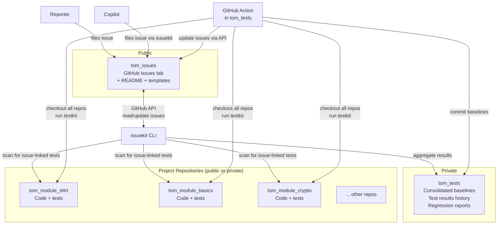

| Repository | Visibility | Purpose |
|------------|-----------|---------|
| **`tom_issues`** | Public | External issue intake — reporters file issues here |
| **`tom_tests`** | Private | Consolidated test results and regression tracking |
| **Project repos** | Public or private | Contain the actual code and issue-linked tests |

### Key Actors

| Actor | Role |
|-------|------|
| **Reporter** | Files an issue in `tom_issues` (human or Copilot) |
| **Triage** | Analyzes root cause, assigns to project (`:analyze`, `:assign`) |
| **Developer / Copilot** | Creates reproduction test, fixes bug, verifies |
| **issuekit** | Orchestrates lifecycle, scans tests, syncs state |
| **testkit** | Runs tests, tracks baselines, detects pass/fail changes |
| **GitHub Actions** | Nightly automated test runs from `tom_tests` |

### ID Scheme

Every entity in the system is identified by a short, scannable ID:

**Project IDs** — 2–4 uppercase characters, declared in `tom_project.yaml`:

| Project | ID |
|---------|---|
| `tom_d4rt` | `D4` |
| `tom_d4rt_generator` | `D4G` |
| `tom_d4rt_dcli` | `D4D` |
| `tom_build_kit` | `BK` |
| `tom_test_kit` | `TK` |
| `tom_issue_kit` | `IK` |
| `tom_crypto` | `CR` |
| `tom_basics` | `BA` |

**Issue IDs** — just the GitHub Issue number: `#42`, `#103`.

**Test IDs** — two forms:

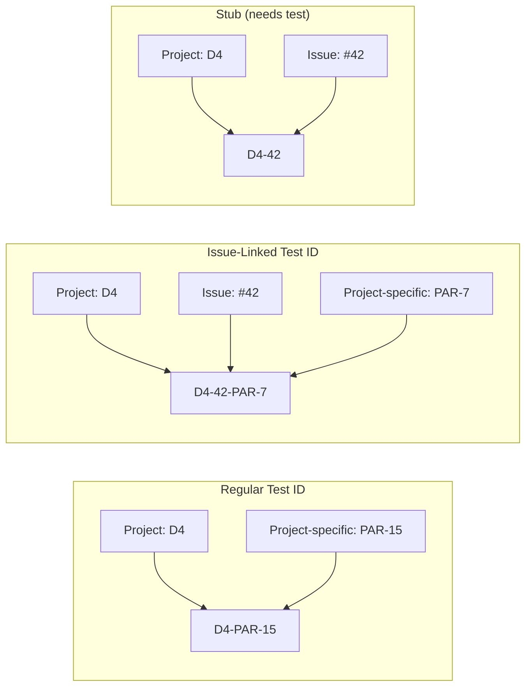

| Form | Format | Example | When |
|------|--------|---------|------|
| Regular | `<PROJECT_ID>-<project-specific>` | `D4-PAR-15` | Normal development |
| Issue-linked | `<PROJECT_ID>-<issue>-<project-specific>` | `D4-42-PAR-7` | Linked to a `tom_issues` issue |
| Stub | `<PROJECT_ID>-<issue>` | `D4-42` | Issue assigned, no test yet |

**Promotion**: `D4-PAR-15` → `D4-42-PAR-15` (insert issue number; project-specific part stays the same).

**Uniqueness**: The `<project-specific>` part must be unique within the project. issuekit `:validate` checks this.

### Issue Lifecycle

Issues move through a defined state machine, with each transition driven by an issuekit command:

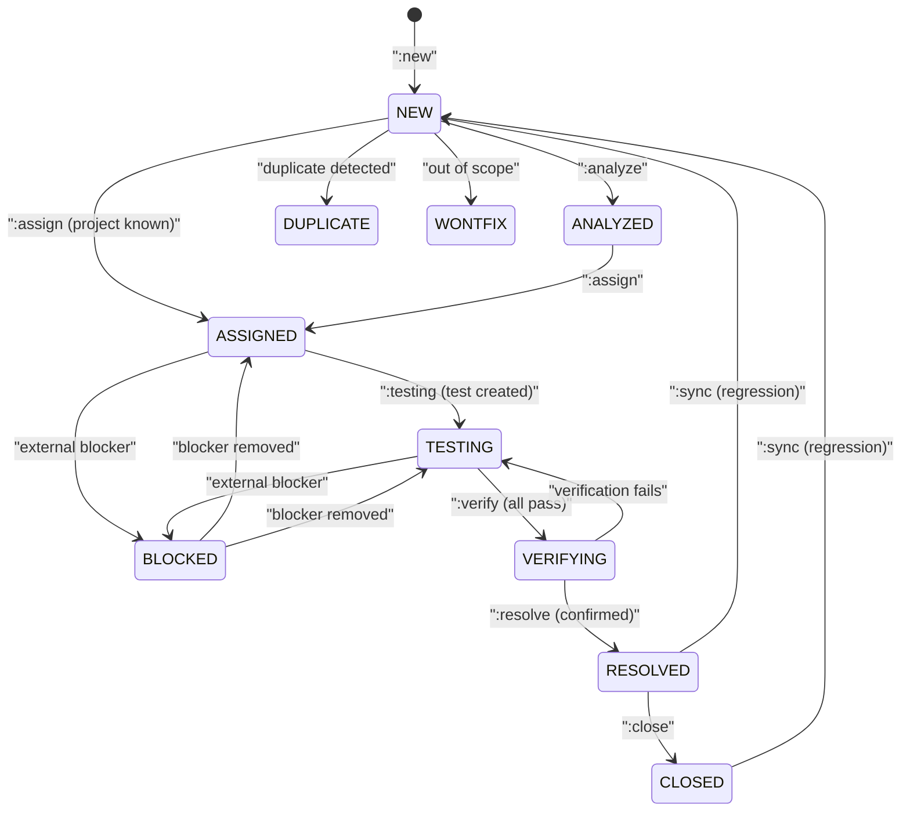

| State | issuekit command | What happens |
|-------|-----------------|--------------|
| → NEW | `:new` | Issue created in `tom_issues` via API |
| → ANALYZED | `:analyze` | Root cause recorded, comment added |
| → ASSIGNED | `:assign` | Project identified, stub `D4-42` created, labels updated |
| → TESTING | `:testing` | Full test ID verified (not just stub), label updated |
| → VERIFYING | `:verify` | All linked tests pass, label updated |
| → RESOLVED | `:resolve` | Fix confirmed by reporter, label updated |
| → CLOSED | `:close` | Issue closed via API |
| → NEW (reopen) | `:sync` / `:reopen` | Regression detected or manual reopen |

### The Pipeline

The complete issue-to-resolution flow, showing which commands drive each step:

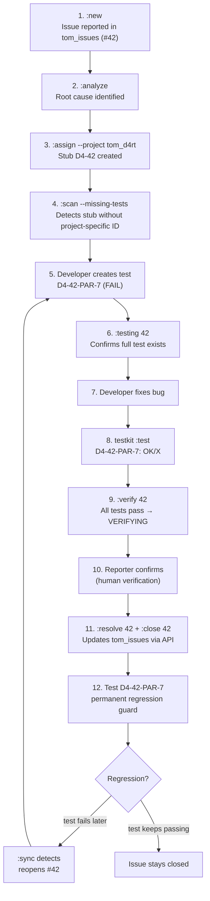

### Copilot Cross-Project Issue Reporting

Copilot sessions can file issues against other projects and pick them up later:

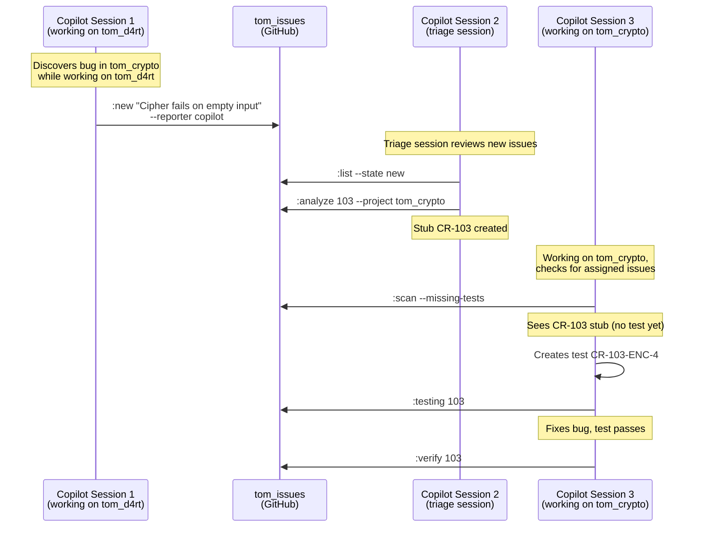

### Convention-Based Test Linking

The mechanism that connects issues to tests without a database:

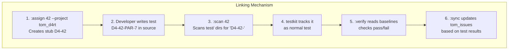

| What | How |
|------|-----|
| Find all tests for issue #42 | Scan `test/` dirs for `<PROJECT_ID>-42-` in descriptions |
| Check test status | Read testkit `doc/baseline_*.csv` |
| Detect missing tests | Look for stubs (`D4-42`) without project-specific parts |
| Detect regressions | Compare baselines: `OK → X` = regression |

### Project Traversal Options

Commands that scan the workspace (`:scan`, `:verify`, `:sync`, `:validate`, `:aggregate`) support these options:

| Option | Description |
|--------|-------------|
| `-R, --root[=<path>]` | Workspace mode: detect or specify workspace root |
| `-s, --scan=<path>` | Scan a specific directory for projects |
| `-r, --recursive` | Recurse into subdirectories |
| `-p, --project=<pattern>` | Filter by project name pattern |
| `-i, --include=<pattern>` | Include only matching projects |
| `-o, --exclude=<pattern>` | Exclude matching projects |
| `-l, --list` | List projects that would be processed |

API-based commands (`:new`, `:edit`, `:list`, `:show`, `:search`, `:close`, `:reopen`, `:resolve`) operate via GitHub API and don't need traversal.

[TOC](#table-of-contents) | [Intro](#introduction) | [Commands](#commands)

---

## Commands

### :aggregate

#### Options

```
issuekit :aggregate
```

| Option | Description |
|--------|-------------|
| `--output=<spec>` | Output format: `plain` (default), `csv`, `json`, `md`, or `<format>:<file>` |
| `-R, --root[=<path>]` | Workspace root |
| `-s, --scan=<path>` | Scan directory |
| `-r, --recursive` | Recurse into subdirectories |
| `-p, --project=<pattern>` | Filter projects |
| `-i, --include=<pattern>` | Include pattern |
| `-o, --exclude=<pattern>` | Exclude pattern |

#### Summary

Merges testkit baselines from all projects into a consolidated CSV in `tom_tests`. This gives a single-file, cross-project view of every issue-linked test with result history. Typically run nightly by a GitHub Action, but can also be triggered manually after a test run.

#### Use Case

In a multi-project workspace, each project has its own testkit baselines in `doc/baseline_*.csv`. These show test results over time — but only for that one project. When tracking issues that span multiple projects, or when looking at the overall health of the workspace, you need a unified view.

`:aggregate` solves this by traversing all projects, reading their most recent baselines, and merging them into a single CSV in the `tom_tests` repository:

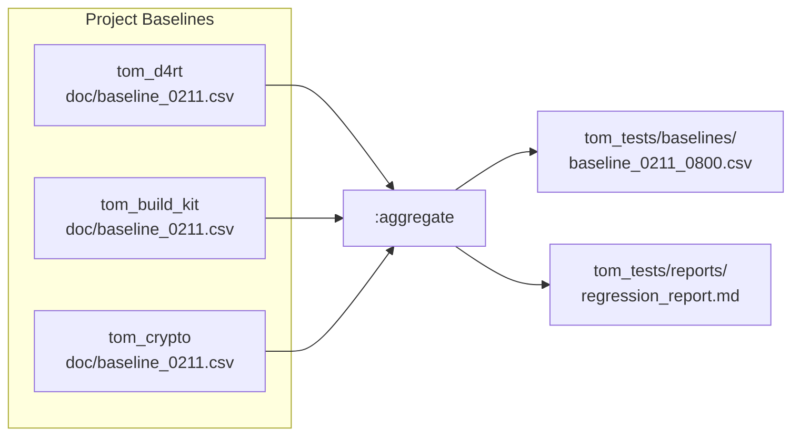

The consolidated baseline looks like:

```csv
Project,Test ID,Description,0210_0800,0211_0800
D4,D4-42-PAR-7,Array parser crashes on empty arrays,X,OK
D4,D4-42-PAR-8,Array parser crashes on null elements,X,OK
BK,BK-42-BLD-12,Build recovers from parser crash,OK,OK
CR,CR-103-ENC-4,Cipher fails on empty input,X,X
```

The `:aggregate` command also generates a regression report highlighting changes: `OK → X` (regression), `X → OK` (fix), `-- → X` (new failure).

This consolidated view is what `:sync` reads to detect regressions and state changes across the full workspace. It is also the artifact committed by the nightly GitHub Action.

#### Examples

```bash
# Aggregate all projects in the workspace
issuekit :aggregate

# Aggregate only tom_d4rt and tom_crypto
issuekit :aggregate -i "tom_d4rt" -i "tom_crypto"

# Aggregate and write a JSON report
issuekit :aggregate --output=json:tom_tests/reports/latest.json

# Dry-run: list which projects would be included
issuekit :aggregate -l
```

[TOC](#table-of-contents) | [Intro](#introduction) | [Commands](#commands) | :aggregate: [Summary](#summary-1) | [Use Case](#use-case-1) | [Examples](#examples-1) — [:analyze](#analyze) | [:verify](#verify)

---

### :analyze

#### Options

```
issuekit :analyze <issue-number> [options]
```

| Option | Description |
|--------|-------------|
| `--root-cause=<text>` | Explanation of the root cause |
| `--project=<name>` | Identified target project (also triggers assignment + stub creation) |
| `--module=<name>` | Identified target module within the project |
| `--note=<text>` | Additional analysis notes |

#### Summary

Records analysis findings for an issue — root cause, affected project, and module. Adds a structured comment to the GitHub Issue. If `--project` is provided, also assigns the issue and creates the stub test ID, combining the `:analyze` and `:assign` steps.

#### Use Case

After an issue is filed (`:new`), someone must investigate it: what's the root cause, and which project owns the fix? This is the triage step.

`:analyze` records the findings directly on the GitHub Issue as a structured comment. This creates an audit trail — future readers can see the reasoning behind the project assignment.

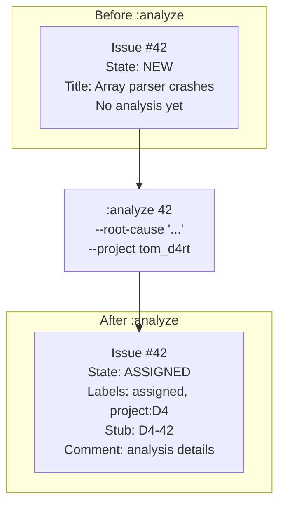

When `--project` is provided, `:analyze` is a two-in-one command: it records the analysis AND assigns the issue. Without `--project`, it only records the analysis and moves the issue to `ANALYZED`.

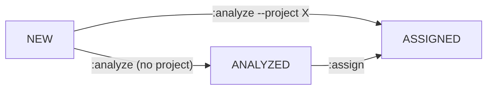

The analysis comment on the GitHub Issue includes:
- Root cause explanation
- Target project and module (if identified)
- Additional notes
- Timestamp and analyst identity

This information helps the developer who later creates the reproduction test understand what to test and where to look.

#### Examples

```bash
# Analyze with root cause and project (combines analyze + assign)
issuekit :analyze 42 \
  --root-cause "Array parser does not handle length-0 case in _parseArrayElements()" \
  --project tom_d4rt \
  --module parser

# Analyze without assigning (root cause unclear, needs more investigation)
issuekit :analyze 42 \
  --note "Likely a parser issue, but could also be in the tokenizer. Need to check both."

# Analyze with project but no module
issuekit :analyze 103 \
  --root-cause "CipherEngine.encrypt does not guard against empty input" \
  --project tom_crypto
```

[TOC](#table-of-contents) | [Intro](#introduction) | [Commands](#commands) | :analyze: [Summary](#summary-2) | [Use Case](#use-case-2) | [Examples](#examples-2) — [:aggregate](#aggregate) | [:assign](#assign)

---

### :assign

#### Options

```
issuekit :assign <issue-number> --project=<name> [options]
```

| Option | Description |
|--------|-------------|
| `--project=<name>` | Target project (required) |
| `--module=<name>` | Target module within the project |
| `--assignee=<name>` | Person or entity responsible for the fix |

#### Summary

Assigns an issue to a specific project and creates the stub test ID. Updates GitHub Issue labels to `assigned` and `project:<PROJECT_ID>`. This is the step that establishes ownership — after assignment, the issue belongs to a project and appears in that project's issue scan results.

#### Use Case

Once the root cause is identified (via `:analyze` or direct knowledge), the issue must be assigned to the project that owns the fix. `:assign` does three things:

1. Creates a **stub test ID** (`D4-42`) — this is the initial link between the issue and the project
2. Updates the GitHub Issue **labels** to `assigned` and `project:<PROJECT_ID>`
3. Adds a **comment** noting the assignment and stub ID

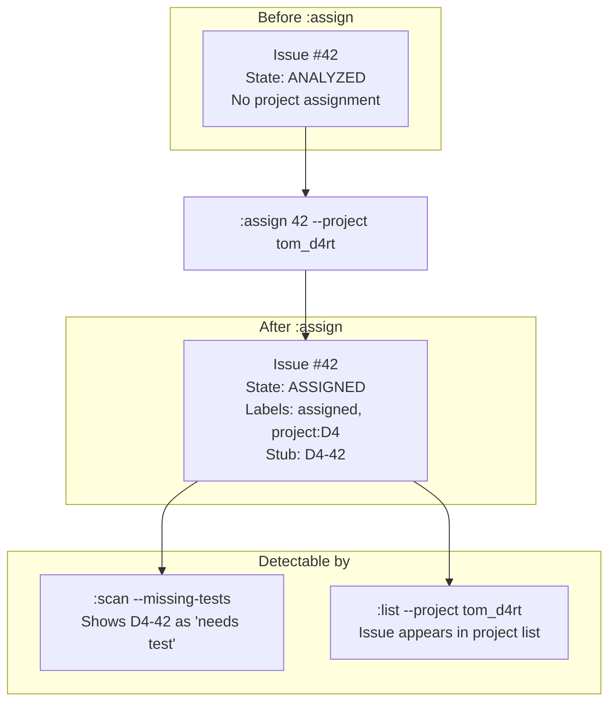

The stub `D4-42` is critical: it signals to `:scan --missing-tests` that this issue is assigned but has no reproduction test yet. This drives the next step — test creation.

If the target project is already known at filing time, `:new --project tom_d4rt` can skip the `:analyze` / `:assign` steps entirely.

#### Examples

```bash
# Assign to a project
issuekit :assign 42 --project tom_d4rt

# Assign with module and person
issuekit :assign 42 --project tom_d4rt --module parser --assignee alexis

# Assign a cross-project issue to tom_crypto
issuekit :assign 103 --project tom_crypto --module cipher
```

[TOC](#table-of-contents) | [Intro](#introduction) | [Commands](#commands) | :assign: [Summary](#summary-3) | [Use Case](#use-case-3) | [Examples](#examples-3) — [:analyze](#analyze) | [:close](#close)

---

### :close

#### Options

```
issuekit :close <issue-number>
```

No additional options. The issue must be in `RESOLVED` state.

#### Summary

Closes a resolved issue via the GitHub API. Adds a resolution summary comment and closes the issue. The linked reproduction tests remain in the codebase permanently as regression guards.

#### Use Case

`:close` is the final step in the issue lifecycle. After the fix has been verified (`:verify`) and the resolution confirmed (`:resolve`), `:close` archives the issue.

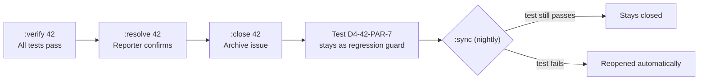

The issue is closed via the GitHub API. A summary comment is added listing:
- All linked test IDs and their final status
- The fix description (from `:resolve`)
- Closure timestamp

Closing an issue does NOT delete anything — the test remains, the issue remains accessible in GitHub, and `:sync` continues to monitor it for regressions. If a linked test ever fails again, `:sync` will automatically reopen the issue.

#### Examples

```bash
# Close a resolved issue
issuekit :close 42

# Close after verifying and resolving
issuekit :verify 42    # → VERIFYING
issuekit :resolve 42 --fix "Added empty check"  # → RESOLVED
issuekit :close 42     # → CLOSED
```

[TOC](#table-of-contents) | [Intro](#introduction) | [Commands](#commands) | :close: [Summary](#summary-4) | [Use Case](#use-case-4) | [Examples](#examples-4) — [:assign](#assign) | [:edit](#edit)

---

### :edit

#### Options

```
issuekit :edit <issue-number> [field options]
```

| Option | Description |
|--------|-------------|
| `--title=<text>` | Update issue title |
| `--severity=<level>` | Update severity: `critical`, `high`, `normal`, `low` |
| `--context=<text>` | Update discovery context |
| `--expected=<text>` | Update expected behavior |
| `--symptom=<text>` | Update observable symptoms |
| `--tags=<t1,t2,...>` | Replace tags (comma-separated) |
| `--project=<name>` | Reassign to a different project |
| `--module=<name>` | Update module |
| `--assignee=<name>` | Update assignee |

#### Summary

Modifies fields on an existing issue via the GitHub API. Any field can be updated independently. If `--project` changes the project assignment, the stub test ID is updated accordingly.

#### Use Case

Issues evolve as understanding improves. Initial reports may have the wrong severity, unclear descriptions, or need reassignment to a different project after deeper analysis.

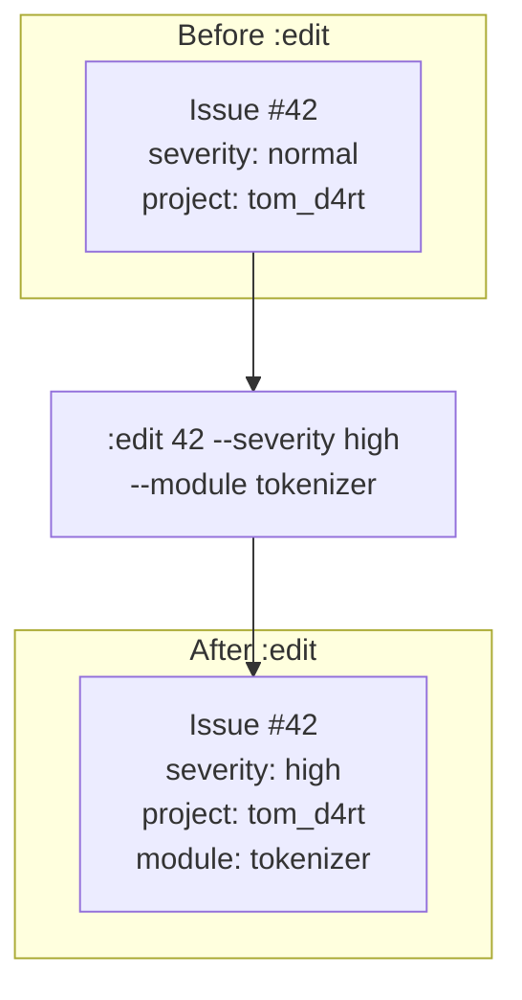

When reassigning to a different project (`--project`), the stub test ID changes:

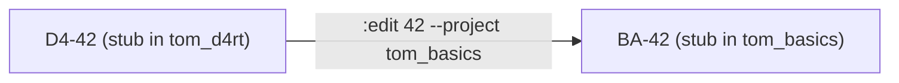

Note: if full tests already exist with the old project ID (`D4-42-PAR-7`), them must be manually renamed — `:edit` does not rewrite test source files. It only updates the stub in the issue metadata.

#### Examples

```bash
# Update severity
issuekit :edit 42 --severity critical

# Update title after better understanding
issuekit :edit 42 --title "Array parser crashes on empty AND null arrays"

# Reassign to different project
issuekit :edit 42 --project tom_basics --module collections

# Add tags
issuekit :edit 42 --tags "parser,regression,critical"
```

[TOC](#table-of-contents) | [Intro](#introduction) | [Commands](#commands) | :edit: [Summary](#summary-5) | [Use Case](#use-case-5) | [Examples](#examples-5) — [:close](#close) | [:export](#export)

---

### :export

#### Options

```
issuekit :export [filters] --output=<spec>
```

| Option | Description |
|--------|-------------|
| `--output=<spec>` | Output format: `csv`, `json`, `md`, or `<format>:<file>` (required) |
| `--state=<state>` | Filter by state |
| `--severity=<level>` | Filter by severity |
| `--project=<name>` | Filter by project |
| `--tags=<t1,t2>` | Filter by tags |
| `--all` | Include closed issues |

#### Summary

Exports issues from `tom_issues` to a file for offline processing, reporting, or migration. Supports CSV, JSON, and Markdown formats. Same filtering options as `:list`.

#### Use Case

There are scenarios where you need issue data outside of GitHub:

- **Reporting**: Generate a CSV of all open issues for a stakeholder review
- **Migration**: Export all issues before moving to a different system
- **Offline analysis**: Pull down issues for batch processing or metrics

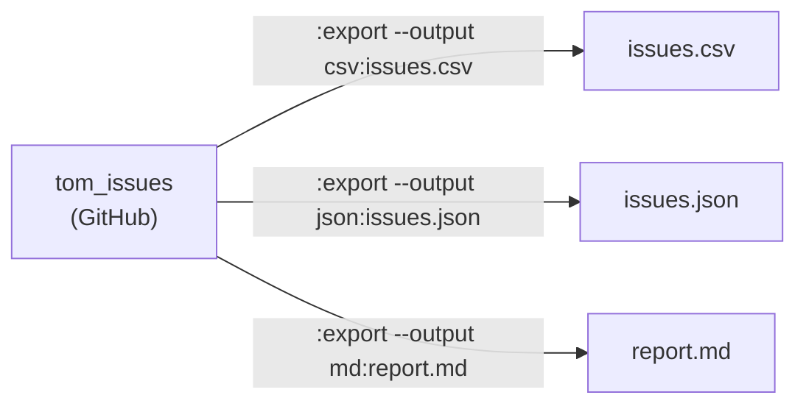

#### Examples

```bash
# Export all open issues as CSV
issuekit :export --output=csv:open_issues.csv

# Export critical issues as Markdown
issuekit :export --severity critical --output=md:critical_issues.md

# Export all issues (including closed) as JSON
issuekit :export --all --output=json:all_issues.json

# Export tom_d4rt issues
issuekit :export --project tom_d4rt --output=csv:d4rt_issues.csv
```

[TOC](#table-of-contents) | [Intro](#introduction) | [Commands](#commands) | :export: [Summary](#summary-6) | [Use Case](#use-case-6) | [Examples](#examples-6) — [:edit](#edit) | [:import](#import)

---

### :import

#### Options

```
issuekit :import <file>
```

| Option | Description |
|--------|-------------|
| `<file>` | Path to JSON or CSV file with issues to import (required) |
| `--dry-run` | Show what would be created without actually creating |

#### Summary

Imports issues from a file into `tom_issues`. Useful for migration from another system or for bulk-creating issues from a structured file. Each record becomes a new GitHub Issue.

#### Use Case

When migrating from another issue tracker, or when a batch of issues has been collected offline (e.g., from a test audit), `:import` creates them all in `tom_issues` at once.

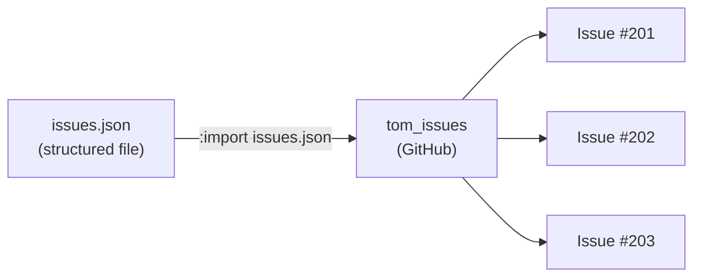

The import file follows the same schema as `:export` output — so a roundtrip is possible: export from one system, edit, re-import.

#### Examples

```bash
# Import from a JSON file
issuekit :import collected_issues.json

# Dry-run to preview what would be created
issuekit :import audit_findings.csv --dry-run
```

[TOC](#table-of-contents) | [Intro](#introduction) | [Commands](#commands) | :import: [Summary](#summary-7) | [Use Case](#use-case-7) | [Examples](#examples-7) — [:export](#export) | [:init](#init)

---

### :init

#### Options

```
issuekit :init [options]
```

| Option | Description |
|--------|-------------|
| `--repo=<name>` | Target repository (default: `tom_issues` from workspace config) |
| `--force` | Overwrite existing labels and templates |

#### Summary

Initializes a GitHub repository for issue tracking integration. Sets up labels matching issuekit states and severities, creates issue templates, and optionally adds a collaborator-only gating Action for public repos.

#### Use Case

Before issuekit can manage issues in a repository, the repository needs the correct labels. `:init` creates them in one step:

```mermaid
graph TB
    INIT[":init --repo tom_issues"]

    subgraph "Labels Created"
        L1["new (blue)"]
        L2["analyzed (purple)"]
        L3["assigned (yellow)"]
        L4["testing (orange)"]
        L5["verifying (cyan)"]
        L6["resolved (green)"]
        L7["blocked (red)"]
        L8["severity:critical (red)"]
        L9["severity:high (orange)"]
        L10["severity:normal (blue)"]
        L11["severity:low (gray)"]
        L12["project:D4 (varies)"]
        L13["reporter:copilot (purple)"]
    end

    subgraph "Templates Created"
        T1[".github/ISSUE_TEMPLATE/<br/>bug_report.md"]
        T2[".github/ISSUE_TEMPLATE/<br/>config.yml"]
    end

    INIT --> L1 & L2 & L3 & L4 & L5 & L6 & L7 & L8 & L9 & L10 & L11 & L12 & L13
    INIT --> T1 & T2
```

The label mapping:

| Label | Color | Purpose |
|-------|-------|---------|
| `new` | blue | Issue just filed |
| `analyzed` | purple | Root cause identified |
| `assigned` | yellow | Assigned to a project |
| `testing` | orange | Reproduction test exists |
| `verifying` | cyan | Tests pass, awaiting confirmation |
| `resolved` | green | Fix confirmed |
| `blocked` | red | Waiting on external factor |
| `duplicate` | gray | Duplicate of another issue |
| `wontfix` | gray | Out of scope |
| `severity:critical` | red | Critical severity |
| `severity:high` | orange | High severity |
| `severity:normal` | blue | Normal severity |
| `severity:low` | gray | Low severity |
| `project:<ID>` | varies | Per-project labels |
| `reporter:copilot` | purple | Filed by Copilot |

#### Examples

```bash
# Initialize tom_issues with standard labels
issuekit :init

# Initialize a specific repo
issuekit :init --repo al-the-bear/tom_issues

# Force-recreate labels (fix colors, add missing ones)
issuekit :init --force
```

[TOC](#table-of-contents) | [Intro](#introduction) | [Commands](#commands) | :init: [Summary](#summary-8) | [Use Case](#use-case-8) | [Examples](#examples-8) — [:import](#import) | [:link](#link)

---

### :link

#### Options

```
issuekit :link <issue-number> --test-id=<id> [options]
```

| Option | Description |
|--------|-------------|
| `--test-id=<id>` | The test ID to link (required) |
| `--test-file=<path>` | Path to the test file (optional, for non-standard locations) |
| `--note=<text>` | Reason for the explicit link |

#### Summary

Explicitly links a test to an issue as an override for non-standard IDs. Normally, issuekit discovers issue-test links by scanning for the `<PROJECT_ID>-<issue>-` pattern. `:link` handles cases where a test doesn't follow the convention but is still relevant.

#### Use Case

Most test linking happens automatically via the ID convention. But there are edge cases:

- A test was written before the convention was established
- A test covers multiple issues and the ID can only encode one
- A third-party test or integration test doesn't follow the naming scheme

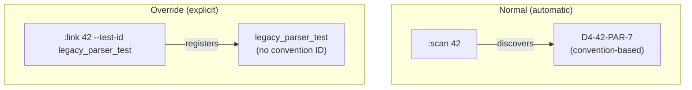

Explicit links are stored as comments on the GitHub Issue and are also checked by `:verify` and `:sync`.

#### Examples

```bash
# Link a legacy test
issuekit :link 42 --test-id "legacy_parser_empty_array" \
  --test-file "test/legacy/parser_test.dart" \
  --note "Pre-convention test, still relevant"

# Link a test that covers multiple issues
issuekit :link 103 --test-id "D4-42-PAR-7" \
  --note "This test also exercises the cipher bug path"
```

[TOC](#table-of-contents) | [Intro](#introduction) | [Commands](#commands) | :link: [Summary](#summary-9) | [Use Case](#use-case-9) | [Examples](#examples-9) — [:init](#init) | [:list](#list)

---

### :list

#### Options

```
issuekit :list [filters]
```

| Option | Description |
|--------|-------------|
| `--state=<state>` | Filter by state label (`new`, `analyzed`, `assigned`, `testing`, `verifying`, `resolved`) |
| `--severity=<level>` | Filter by severity (`critical`, `high`, `normal`, `low`) |
| `--project=<name>` | Filter by assigned project |
| `--tags=<t1,t2>` | Filter by tags/labels |
| `--reporter=<name>` | Filter by reporter (e.g., `copilot`) |
| `--all` | Include closed issues (default: only open) |
| `--sort=<field>` | Sort by: `created`, `severity`, `state`, `project` |
| `--output=<spec>` | Output format: `plain` (default), `csv`, `json`, `md`, or `<format>:<file>` |

#### Summary

Lists issues from `tom_issues` with filtering and sorting. The primary discovery command for finding issues by state, severity, project, or tags. Used during triage sessions to review new issues and by developers to check their project's workload.

#### Use Case

`:list` is the workhorse for issue discovery. Different stakeholders use it differently:

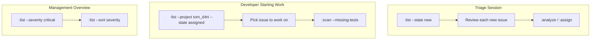

Output example (plain format):

```
#42  [HIGH]     D4    TESTING    Array parser crashes on empty arrays
#56  [NORMAL]   BK    ASSIGNED   Build fails on Windows with spaces in path
#78  [LOW]      CR    NEW        Cipher documentation typo in example
#103 [HIGH]     CR    ASSIGNED   Cipher fails on empty input
```

#### Examples

```bash
# All new issues (triage queue)
issuekit :list --state new

# All issues assigned to tom_d4rt
issuekit :list --project tom_d4rt

# Critical issues across all projects
issuekit :list --severity critical

# Issues filed by Copilot
issuekit :list --reporter copilot

# All issues including closed, sorted by creation date
issuekit :list --all --sort created

# Export the list as CSV
issuekit :list --state testing --output=csv:testing_issues.csv

# Combine filters
issuekit :list --project tom_crypto --severity high --state assigned
```

[TOC](#table-of-contents) | [Intro](#introduction) | [Commands](#commands) | :list: [Summary](#summary-10) | [Use Case](#use-case-10) | [Examples](#examples-10) — [:link](#link) | [:new](#new)

---

### :new

#### Options

```
issuekit :new "<title>" [options]
```

| Option | Description |
|--------|-------------|
| `--severity=<level>` | Severity: `critical`, `high`, `normal` (default), `low` |
| `--context=<text>` | Where/how the problem was discovered |
| `--expected=<text>` | Expected behavior |
| `--symptom=<text>` | Observable symptoms (defaults to title if not set) |
| `--tags=<t1,t2,...>` | Comma-separated tags (mapped to GitHub labels) |
| `--project=<name>` | Pre-assign to a project (skips NEW → goes directly to ASSIGNED, creates stub) |
| `--reporter=<name>` | Reporter name (default: configured user, or `copilot` for AI sessions) |

#### Summary

Creates a new issue in the `tom_issues` GitHub repository via the API. This is the entry point for all issues — the first step in the pipeline. If `--project` is provided, the issue skips the NEW state and goes directly to ASSIGNED with a stub test ID.

#### Use Case

`:new` is used whenever someone (human or Copilot) discovers a problem. The command captures enough context to act on the issue later, even if the filer doesn't have time to investigate now.

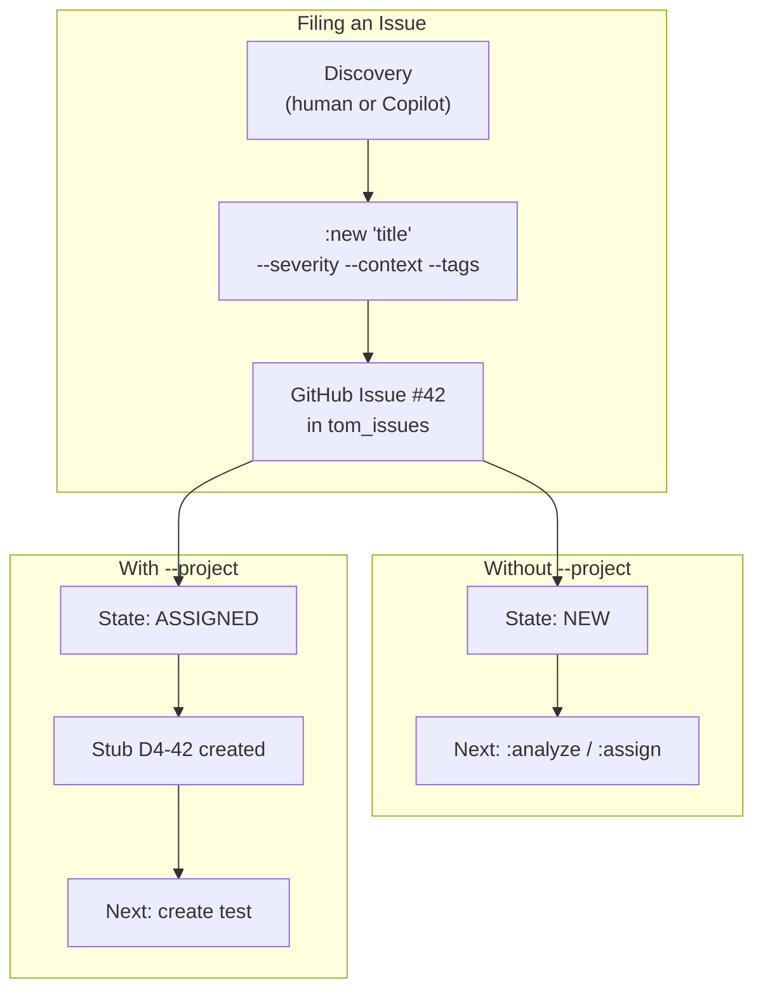

**Copilot cross-project filing**: When Copilot discovers a bug in project B while working on project A, it files the issue immediately with `--reporter copilot`. The triage session picks it up later.

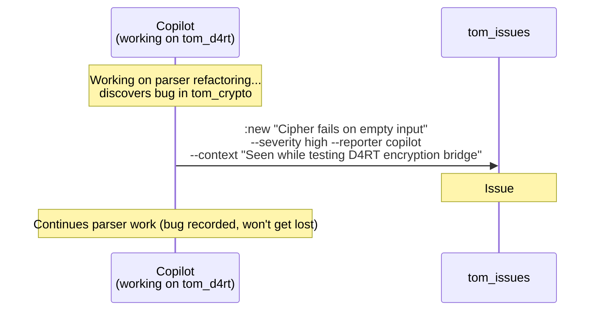

The issue captures:
- **Title**: Brief problem description
- **Severity**: How urgent (affects triage priority)
- **Context**: Where/how discovered (helps reproduction)
- **Expected behavior**: What should happen instead
- **Tags**: Categorization for filtering

#### Examples

```bash
# Minimal — just a title
issuekit :new "Memory leak in long-running server"

# With severity and tags
issuekit :new "Incorrect UTF-8 decoding" --severity high --tags "encoding,parser"

# Pre-assigned to a project (skips triage)
issuekit :new "Timeout on large files" --project tom_d4rt \
  --context "Seen during stress test with 500MB JSON"

# Copilot filing a cross-project bug
issuekit :new "Cipher fails on empty input" \
  --severity high \
  --reporter copilot \
  --context "Discovered while implementing D4RT bridge encryption" \
  --expected "Empty input should produce empty output" \
  --tags "crypto,cipher,edge-case"

# Full details upfront
issuekit :new "Build output missing on Windows" \
  --severity normal \
  --symptom "buildkit :build produces no output files on Windows with spaces in path" \
  --expected "Output files should be generated regardless of path characters" \
  --context "Reported by CI runner on windows-latest" \
  --tags "build,windows,path" \
  --project tom_build_kit
```

[TOC](#table-of-contents) | [Intro](#introduction) | [Commands](#commands) | :new: [Summary](#summary-11) | [Use Case](#use-case-11) | [Examples](#examples-11) — [:list](#list) | [:promote](#promote)

---

### :promote

#### Options

```
issuekit :promote <test-id> --issue <issue-number>
```

| Option | Description |
|--------|-------------|
| `<test-id>` | Current test ID (regular format, e.g., `D4-PAR-15`) (required) |
| `--issue <number>` | Issue number to link to (required) |
| `--dry-run` | Show what would change without modifying files |

#### Summary

Promotes a regular test to an issue-linked test by inserting the issue number into the ID. The project-specific part stays the same, preserving the test's identity. The source file is modified in-place.

#### Use Case

Sometimes a test that was written for a feature turns out to be relevant to a reported issue. Instead of creating a duplicate test, the existing test can be promoted:

```mermaid
graph TB
    subgraph "Before :promote"
        T1["D4-PAR-15<br/>Regular test — no issue link<br/>test('D4-PAR-15: Parser handles nested...']"]
    end

    P[":promote D4-PAR-15 --issue 42"]

    subgraph "After :promote"
        T2["D4-42-PAR-15<br/>Issue-linked test<br/>test('D4-42-PAR-15: Parser handles nested...']"]
    end

    T1 --> P --> T2

    subgraph "What stays the same"
        S1["Project-specific ID: PAR-15"]
        S2["Test logic unchanged"]
        S3["testkit baseline tracks the rename"]
    end
```

The promotion:
1. **Scans** the workspace for the test ID in test descriptions
2. **Renames** the ID in the source file: `D4-PAR-15` → `D4-42-PAR-15`
3. **Preserves** the project-specific part (`PAR-15`) — this is the stable identity
4. **Records** the rename in a comment for testkit baseline tracking

Since the uniqueness rule says `D4-PAR-15` and `D4-42-PAR-15` refer to the same conceptual test, they should not both exist. Promotion replaces the old ID.

#### Examples

```bash
# Promote a test to link to issue #42
issuekit :promote D4-PAR-15 --issue 42

# Preview the change without modifying
issuekit :promote BK-BLD-3 --issue 56 --dry-run

# Promote a crypto test
issuekit :promote CR-ENC-7 --issue 103
```

[TOC](#table-of-contents) | [Intro](#introduction) | [Commands](#commands) | :promote: [Summary](#summary-12) | [Use Case](#use-case-12) | [Examples](#examples-12) — [:new](#new) | [:reopen](#reopen)

---

### :reopen

#### Options

```
issuekit :reopen <issue-number> [options]
```

| Option | Description |
|--------|-------------|
| `--note=<text>` | Reason for reopening |

#### Summary

Reopens a closed or resolved issue. Used when a regression is detected manually or when the original fix is found to be incomplete. Adds a comment with the reason and resets the state to NEW.

#### Use Case

There are two paths to reopening:

```mermaid
graph TB
    subgraph "Automatic (via :sync)"
        SY[":sync detects regression<br/>D4-42-PAR-7: OK → X"]
        SY --> AR["Automatically reopens #42<br/>Comment: 'Regression detected'"]
    end

    subgraph "Manual (via :reopen)"
        HU["Developer/reporter discovers<br/>fix was incomplete"]
        HU --> MR[":reopen 42<br/>--note 'Fix only handles arrays, not objects'"]
    end

    AR --> NEW["Issue #42<br/>State: NEW<br/>(cycle restarts)"]
    MR --> NEW
```

`:sync` handles automatic reopening for regressions detected by test failures. `:reopen` handles the manual case — when someone realizes the fix was incomplete or a new aspect of the same problem surfaces.

After reopening, the issue restarts the lifecycle at NEW. The existing tests remain and new ones can be added.

#### Examples

```bash
# Manual reopen with explanation
issuekit :reopen 42 --note "Fix only addressed empty arrays, not null elements"

# Reopen after user report
issuekit :reopen 103 --note "Reporter still sees the issue in production"

# Simple reopen
issuekit :reopen 56
```

[TOC](#table-of-contents) | [Intro](#introduction) | [Commands](#commands) | :reopen: [Summary](#summary-13) | [Use Case](#use-case-13) | [Examples](#examples-13) — [:promote](#promote) | [:resolve](#resolve)

---

### :resolve

#### Options

```
issuekit :resolve <issue-number> [options]
```

| Option | Description |
|--------|-------------|
| `--fix=<text>` | Short description of the fix applied |
| `--note=<text>` | Additional notes |

#### Summary

Confirms that the fix addresses the original issue. Requires the issue to be in `VERIFYING` state (all tests pass). This is the human confirmation step — the reporter or reviewer confirms the original symptom is gone.

#### Use Case

`:verify` checks that tests pass (machine verification). `:resolve` is the **human confirmation** that the original problem is actually solved.

```mermaid
graph TB
    subgraph "Machine Verification"
        V[":verify 42"]
        V --> CHK{"All tests pass?"}
        CHK -->|"Yes"| VER["State: VERIFYING<br/>'The tests pass'"]
        CHK -->|"No"| FAIL["Stay in TESTING<br/>Report failing tests"]
    end

    subgraph "Human Verification"
        R[":resolve 42"]
        Q{"Does the original<br/>problem still occur?"}
        Q -->|"No — it's fixed"| RES["State: RESOLVED<br/>'The problem is gone'"]
        Q -->|"Yes — test too narrow"| BACK["Back to TESTING<br/>Need better test"]
    end

    VER --> Q
```

**Why two steps?** A reproduction test might be too narrow. The test passes, but the original problem still occurs under different conditions. `:resolve` is the checkpoint where a human confirms the fix actually works from the reporter's perspective.

The developer also updates the test expectation at this point — removing `(FAIL)` from the test description since the test now represents expected behavior:

```dart
// Before resolve:
test('D4-42-PAR-7: Array parser crashes on empty arrays [2026-02-10 14:00] (FAIL)', ...);

// After resolve:
test('D4-42-PAR-7: Array parser crashes on empty arrays [2026-02-10 14:00]', ...);
```

#### Examples

```bash
# Resolve with fix description
issuekit :resolve 42 --fix "Added empty check in ArrayParser._parseArrayElements()"

# Resolve with additional notes
issuekit :resolve 103 --fix "Guard clause for empty input" \
  --note "Also added documentation for edge cases"

# Simple resolve
issuekit :resolve 56
```

[TOC](#table-of-contents) | [Intro](#introduction) | [Commands](#commands) | :resolve: [Summary](#summary-14) | [Use Case](#use-case-14) | [Examples](#examples-14) — [:reopen](#reopen) | [:run-tests](#run-tests)

---

### :run-tests

#### Options

```
issuekit :run-tests [options]
```

| Option | Description |
|--------|-------------|
| `--wait` | Wait for the workflow to complete (polls status) |

#### Summary

Triggers the nightly test workflow in `tom_tests` via a GitHub API `workflow_dispatch` event. This runs all tests across all projects, aggregates results, and syncs issue states — the same process that runs on schedule, but triggered on demand.

#### Use Case

The nightly GitHub Action in `tom_tests` checks out all repos, runs testkit, aggregates baselines, and runs `:sync`. Sometimes you need this immediately — after a major fix, before a release, or during a triage session.

```mermaid
graph TB
    RT[":run-tests"]
    RT -->|"workflow_dispatch"| GA["GitHub Action<br/>in tom_tests"]
    GA --> CO["Checkout all repos"]
    CO --> TK["Run testkit :baseline<br/>in each project"]
    TK --> AG[":aggregate<br/>Merge baselines"]
    AG --> SY[":sync --auto<br/>Update issue states"]
    SY --> CM["Commit results<br/>to tom_tests"]
```

#### Examples

```bash
# Trigger the nightly workflow immediately
issuekit :run-tests

# Trigger and wait for completion
issuekit :run-tests --wait
```

[TOC](#table-of-contents) | [Intro](#introduction) | [Commands](#commands) | :run-tests: [Summary](#summary-15) | [Use Case](#use-case-15) | [Examples](#examples-15) — [:resolve](#resolve) | [:scan](#scan)

---

### :scan

#### Options

```
issuekit :scan [<issue-number>] [options]
```

| Option | Description |
|--------|-------------|
| `<issue-number>` | Scan for a specific issue's tests (optional) |
| `--project=<name>` | Only scan within a specific project |
| `--state=<state>` | Only scan for issues in a specific state |
| `--missing-tests` | Show issues that have only stub IDs (no full test yet) |
| `--output=<spec>` | Output format: `plain`, `csv`, `json`, `md` |
| `-R, --root[=<path>]` | Workspace root |
| `-s, --scan=<path>` | Scan directory |
| `-r, --recursive` | Recurse |
| `-p, --project=<pattern>` | Filter projects |
| `-i, --include=<pattern>` | Include pattern |
| `-o, --exclude=<pattern>` | Exclude pattern |

#### Summary

Scans the workspace for tests linked to issues via the ID convention. This is the core discovery mechanism — it finds all `<PROJECT_ID>-<issue-number>-<project-specific>` patterns in test descriptions across `test/` directories. Can also detect stubs (assigned issues without full tests).

#### Use Case

`:scan` is the bridge between the GitHub Issue world and the codebase world. It answers questions that no other tool can:

```mermaid
graph TB
    subgraph "Questions :scan Answers"
        Q1["What tests exist for issue #42?"]
        Q2["Which projects have tests for #42?"]
        Q3["Which issues have no tests yet?"]
        Q4["What's the test coverage for all issues?"]
    end

    SC[":scan"]

    subgraph "How It Works"
        S1["Traverse project test/ dirs"]
        S2["Regex match: PROJECT_ID-ISSUE-"]
        S3["Read testkit baselines"]
        S4["Report results"]
    end

    Q1 & Q2 & Q3 & Q4 --> SC --> S1 --> S2 --> S3 --> S4
```

**Scanning for a specific issue:**

```
issuekit :scan 42

Tests for issue #42 (tom_issues):

Project       Test ID         File                                    Line  Status
-----------   -------------   ------------------------------------    ----  ------
tom_d4rt      D4-42-PAR-7     test/parser/array_parser_test.dart      45    FAIL
tom_d4rt      D4-42-PAR-8     test/parser/array_null_test.dart        12    FAIL
tom_build_kit BK-42-BLD-12    test/build/edge_cases_test.dart         88    PASS
```

**Detecting missing tests:**

```mermaid
graph LR
    STUB["D4-42<br/>(stub — no project-specific part)"]
    FULL["D4-42-PAR-7<br/>(full test ID)"]

    SC[":scan --missing-tests"]
    SC -->|"detects"| STUB
    SC -->|"does NOT flag"| FULL
```

```
issuekit :scan --missing-tests

Issues with missing tests:

Issue   Project   Stub ID   State      Title
------  --------  --------  ---------  -----
#42     D4        D4-42     ASSIGNED   Array parser crashes on empty arrays
#103    CR        CR-103    ASSIGNED   Cipher fails on empty input
```

This is the signal that drives test creation — Copilot or a developer sees which issues need reproduction tests.

#### Examples

```bash
# Scan for all tests linked to issue #42
issuekit :scan 42

# Scan all issue-linked tests across the workspace
issuekit :scan

# Only scan tom_d4rt
issuekit :scan --project tom_d4rt

# Find issues with only stub IDs (no full test)
issuekit :scan --missing-tests

# Find missing tests in one project
issuekit :scan --missing-tests --project tom_crypto

# Only scan issues in TESTING state
issuekit :scan --state testing

# Export scan results as CSV
issuekit :scan --output=csv:scan_results.csv
```

[TOC](#table-of-contents) | [Intro](#introduction) | [Commands](#commands) | :scan: [Summary](#summary-16) | [Use Case](#use-case-16) | [Examples](#examples-16) — [:run-tests](#run-tests) | [:search](#search)

---

### :search

#### Options

```
issuekit :search "<query>" [options]
```

| Option | Description |
|--------|-------------|
| `<query>` | Search text (required) |
| `--output=<spec>` | Output format |

#### Summary

Full-text search across all issues in `tom_issues`. Uses the GitHub Issues search API to find issues by content, including titles, descriptions, and comments.

#### Use Case

When you need to find issues by keyword — a specific error message, a component name, or a symptom — `:search` queries the GitHub search API. It searches across titles, descriptions, and all comments on issues.

```mermaid
graph LR
    Q[":search 'RangeError'"]
    Q --> API["GitHub Search API"]
    API --> R1["#42: Array parser crashes..."]
    API --> R2["#89: Map indexer RangeError..."]
```

Unlike `:list` (which filters by structured fields), `:search` is a free-text search — useful when you don't know the exact state, project, or tags but remember a keyword.

#### Examples

```bash
# Search by error message
issuekit :search "RangeError"

# Search by component
issuekit :search "ArrayParser"

# Search by symptom
issuekit :search "empty input"
```

[TOC](#table-of-contents) | [Intro](#introduction) | [Commands](#commands) | :search: [Summary](#summary-17) | [Use Case](#use-case-17) | [Examples](#examples-17) — [:scan](#scan) | [:show](#show)

---

### :show

#### Options

```
issuekit :show <issue-number>
```

No additional options. Shows all available information for the issue.

#### Summary

Displays full details of a single issue — GitHub Issue fields, analysis comments, linked tests (via workspace scan), and current test status from testkit baselines. This is the single-issue deep dive.

#### Use Case

`:show` combines data from two sources: the GitHub Issue (metadata, comments, labels) and the workspace (linked tests, test status). It's the command to run before starting work on an issue.

```mermaid
graph TB
    SH[":show 42"]

    subgraph "From GitHub API"
        G1["Title, description, labels"]
        G2["Analysis comments"]
        G3["State history"]
        G4["Reporter, assignee"]
    end

    subgraph "From Workspace Scan"
        W1["Linked tests: D4-42-PAR-7, D4-42-PAR-8"]
        W2["Test files and line numbers"]
        W3["Pass/fail from baseline"]
    end

    SH --> G1 & G2 & G3 & G4
    SH --> W1 & W2 & W3

    subgraph "Combined Output"
        O["Issue #42 — Array parser crashes on empty arrays<br/>State: TESTING | Severity: HIGH | Project: D4<br/>...<br/>Tests:<br/>  D4-42-PAR-7  FAIL  test/parser/array_parser_test.dart:45<br/>  D4-42-PAR-8  FAIL  test/parser/array_null_test.dart:12"]
    end

    G1 & W1 --> O
```

#### Examples

```bash
# Show full details for issue #42
issuekit :show 42

# Show a newly filed issue (no tests yet)
issuekit :show 103
```

[TOC](#table-of-contents) | [Intro](#introduction) | [Commands](#commands) | :show: [Summary](#summary-18) | [Use Case](#use-case-18) | [Examples](#examples-18) — [:search](#search) | [:summary](#summary-cmd)

---

<a id="summary-cmd"></a>

### :summary

#### Options

```
issuekit :summary [options]
```

| Option | Description |
|--------|-------------|
| `--output=<spec>` | Output format: `plain` (default), `csv`, `json`, `md` |

#### Summary

Displays a dashboard overview of all issues — counts by state, severity, and project. Highlights issues needing attention: missing tests, awaiting verification, Copilot-filed issues pending triage.

#### Use Case

`:summary` gives a bird's-eye view of the issue landscape. It's the first command to run at the start of a session or triage meeting.

```mermaid
graph TB
    SUM[":summary"]

    subgraph "Output Sections"
        S1["By State<br/>NEW: 3 | ASSIGNED: 5 | TESTING: 8<br/>VERIFYING: 2 | RESOLVED: 1"]
        S2["By Severity<br/>CRITICAL: 1 | HIGH: 4 | NORMAL: 10 | LOW: 4"]
        S3["By Project<br/>D4: 7 | BK: 3 | CR: 5 | BA: 2"]
        S4["Attention Needed<br/>Missing tests: 3 | Awaiting verify: 2<br/>Copilot unreviewed: 1"]
    end

    SUM --> S1 & S2 & S3 & S4
```

Output (plain format):
```
Issue Tracking Summary
======================

By State:
  NEW          3
  ANALYZED     1
  ASSIGNED     5
  TESTING      8
  VERIFYING    2
  RESOLVED     1
  BLOCKED      1

By Severity:
  CRITICAL     1    ⚠ #201: Server crash on startup
  HIGH         4
  NORMAL      10
  LOW          4

By Project:
  D4           7
  BK           3
  CR           5
  BA           2

Attention:
  Missing tests (stubs only):  3   → run :scan --missing-tests
  Awaiting verification:       2   → run :verify on each
  Copilot-filed, unreviewed:   1   → run :list --reporter copilot --state new
```

#### Examples

```bash
# Full dashboard
issuekit :summary

# Export as Markdown
issuekit :summary --output=md:summary.md
```

[TOC](#table-of-contents) | [Intro](#introduction) | [Commands](#commands) | :summary: [Summary](#summary-19) | [Use Case](#use-case-19) | [Examples](#examples-19) — [:show](#show) | [:sync](#sync)

---

### :sync

#### Options

```
issuekit :sync [options]
```

| Option | Description |
|--------|-------------|
| `--auto` | Automatically apply state transitions and reopens |
| `--project=<name>` | Only sync issues for a specific project |
| `--dry-run` | Show what would change without applying |
| `-R, --root[=<path>]` | Workspace root |
| `-s, --scan=<path>` | Scan directory |
| `-r, --recursive` | Recurse |
| `-p, --project=<pattern>` | Filter projects |
| `-i, --include=<pattern>` | Include pattern |
| `-o, --exclude=<pattern>` | Exclude pattern |

#### Summary

Synchronizes issue states with test results across the workspace. Detects fixes (tests now pass), regressions (tests now fail), and missing tests. Can automatically apply state transitions and reopen issues on regression. This is the automation backbone — run nightly by GitHub Actions.

#### Use Case

`:sync` is the command that closes the feedback loop. It cross-references every issue in `tom_issues` with the actual test results in the codebase:

```mermaid
graph TB
    SY[":sync"]

    subgraph "For ASSIGNED Issues"
        A1["Scan for full tests"]
        A2{"Full test found?"}
        A3["Suggest → TESTING"]
        A4["No change"]
        A1 --> A2
        A2 -->|"Yes"| A3
        A2 -->|"No (still stub)"| A4
    end

    subgraph "For TESTING Issues"
        T1["Check test results"]
        T2{"All tests pass?"}
        T3["Suggest → VERIFYING"]
        T4["Report failing tests"]
        T1 --> T2
        T2 -->|"Yes"| T3
        T2 -->|"No"| T4
    end

    subgraph "For RESOLVED/CLOSED Issues"
        R1["Check for regressions"]
        R2{"Any test fails?"}
        R3["REOPEN issue<br/>Add regression comment"]
        R4["All clear"]
        R1 --> R2
        R2 -->|"Yes (OK → X)"| R3
        R2 -->|"No"| R4
    end

    SY --> A1 & T1 & R1
```

**The regression loop:**

```mermaid
graph LR
    FIX["Bug fixed<br/>test passes"] --> CLOSE["Issue closed"]
    CLOSE --> NIGHT["Nightly :sync"]
    NIGHT --> CHK{"Test still passes?"}
    CHK -->|"OK"| CLOSE
    CHK -->|"FAIL"| REOPEN["Issue reopened<br/>Comment: 'Regression in D4-42-PAR-7'"]
    REOPEN --> FIX
```

Without `--auto`, `:sync` reports suggested changes but doesn't apply them. With `--auto`, it applies transitions and reopens automatically — this is what the nightly GitHub Action uses.

Output (dry-run):
```
Sync Report
===========

Issue  Current     Suggested   Reason
-----  ----------  ----------  ------
#42    ASSIGNED    → TESTING   Full test D4-42-PAR-7 found
#56    TESTING     → VERIFYING All 2 tests pass
#78    CLOSED      → NEW       Regression: CR-78-ENC-2 now fails (was OK)

Run with --auto to apply changes.
```

#### Examples

```bash
# Dry-run: show what would change
issuekit :sync --dry-run

# Apply all changes automatically
issuekit :sync --auto

# Sync only tom_d4rt issues
issuekit :sync --project tom_d4rt

# Sync without applying (default)
issuekit :sync

# Used in GitHub Action
issuekit :sync --auto
```

[TOC](#table-of-contents) | [Intro](#introduction) | [Commands](#commands) | :sync: [Summary](#summary-20) | [Use Case](#use-case-20) | [Examples](#examples-20) — [:summary](#summary-cmd) | [:testing](#testing)

---

### :testing

#### Options

```
issuekit :testing <issue-number>
```

No additional options. The issue must be in `ASSIGNED` state.

#### Summary

Marks that a reproduction test has been created for an issue. Verifies that at least one **full** test ID (not just a stub) matching the issue exists in the workspace, then updates the GitHub Issue label to `testing`.

#### Use Case

After an issue is assigned (`:assign`), someone creates a reproduction test. `:testing` is the confirmation step — it verifies the test actually exists before transitioning the issue:

```mermaid
graph TB
    subgraph "Before :testing"
        I1["Issue #42<br/>State: ASSIGNED<br/>Stub: D4-42"]
        T1["Developer created:<br/>test('D4-42-PAR-7: ...') in source"]
    end

    TE[":testing 42"]

    subgraph ":testing checks"
        C1["Scan workspace for D4-42-*"]
        C2{"Full test ID found?<br/>(not just stub D4-42)"}
        C3["D4-42-PAR-7 ✓"]
        C4["Error: no full test found"]
    end

    subgraph "After :testing"
        I2["Issue #42<br/>State: TESTING<br/>Label: testing<br/>Comment: 'Test D4-42-PAR-7 found'"]
    end

    I1 --> TE --> C1 --> C2
    C2 -->|"Yes"| C3 --> I2
    C2 -->|"No"| C4
```

The distinction between a **stub** and a **full test**:

| ID | Type | Has project-specific part? | `:testing` accepts? |
|----|------|---------------------------|---------------------|
| `D4-42` | Stub | No | No |
| `D4-42-PAR-7` | Full test | Yes (`PAR-7`) | Yes |

`:testing` refuses to proceed if only a stub exists. This ensures that the issue has an actual reproduction test, not just an assignment marker.

#### Examples

```bash
# Mark that a test exists for issue #42
issuekit :testing 42

# After creating the test in source:
# test('D4-42-PAR-7: Array parser crashes on empty arrays [2026-02-10] (FAIL)', () { ... });
issuekit :testing 42
# → Success: Found D4-42-PAR-7 in tom_d4rt/test/parser/array_parser_test.dart:45
# → Issue #42 updated to TESTING
```

[TOC](#table-of-contents) | [Intro](#introduction) | [Commands](#commands) | :testing: [Summary](#summary-21) | [Use Case](#use-case-21) | [Examples](#examples-21) — [:sync](#sync) | [:validate](#validate)

---

### :validate

#### Options

```
issuekit :validate [options]
```

| Option | Description |
|--------|-------------|
| `--project=<name>` | Only validate a specific project |
| `--fix` | Automatically fix simple conflicts (e.g., remove duplicate regular IDs after promotion) |
| `-R, --root[=<path>]` | Workspace root |
| `-s, --scan=<path>` | Scan directory |
| `-r, --recursive` | Recurse |
| `-p, --project=<pattern>` | Filter projects |
| `-i, --include=<pattern>` | Include pattern |
| `-o, --exclude=<pattern>` | Exclude pattern |

#### Summary

Checks test ID uniqueness across the workspace. Ensures no duplicate project-specific IDs within a project, no conflicts between regular and promoted IDs, and that all issue numbers in test IDs reference existing `tom_issues` issues.

#### Use Case

The uniqueness rule says that `<project-specific-ids>` must be unique within a project. `:validate` enforces this:

```mermaid
graph TB
    VA[":validate"]

    subgraph "Check 1: Duplicate project-specific IDs"
        C1["D4-PAR-15 in parser_test.dart<br/>D4-PAR-15 in other_test.dart"]
        C1R["ERROR: Duplicate PAR-15 in D4"]
    end

    subgraph "Check 2: Regular + promoted conflict"
        C2["D4-PAR-15 exists<br/>D4-42-PAR-15 also exists"]
        C2R["ERROR: PAR-15 exists both as<br/>regular and promoted"]
    end

    subgraph "Check 3: Invalid issue references"
        C3["D4-999-PAR-7<br/>but issue #999 doesn't exist"]
        C3R["WARNING: Issue #999 not found<br/>in tom_issues"]
    end

    VA --> C1 --> C1R
    VA --> C2 --> C2R
    VA --> C3 --> C3R
```

Output:
```
Validation Report
=================

Errors (must fix):
  D4  PAR-15    Duplicate: test/parser_test.dart:12 AND test/other_test.dart:45
  D4  PAR-15    Conflict: regular D4-PAR-15 AND promoted D4-42-PAR-15

Warnings:
  D4  D4-999-PAR-7    Issue #999 not found in tom_issues

Summary: 2 errors, 1 warning across 47 tests in 8 projects
```

Run `:validate` after bulk promotions, imports, or test reorganizations to ensure the ID scheme is consistent.

#### Examples

```bash
# Validate the entire workspace
issuekit :validate

# Validate only tom_d4rt
issuekit :validate --project tom_d4rt

# Validate and auto-fix simple conflicts
issuekit :validate --fix
```

[TOC](#table-of-contents) | [Intro](#introduction) | [Commands](#commands) | :validate: [Summary](#summary-22) | [Use Case](#use-case-22) | [Examples](#examples-22) — [:testing](#testing) | [:verify](#verify)

---

### :verify

#### Options

```
issuekit :verify <issue-number> [options]
```

| Option | Description |
|--------|-------------|
| `-R, --root[=<path>]` | Workspace root |
| `-s, --scan=<path>` | Scan directory |
| `-r, --recursive` | Recurse |
| `-p, --project=<pattern>` | Filter projects |
| `-i, --include=<pattern>` | Include pattern |
| `-o, --exclude=<pattern>` | Exclude pattern |

#### Summary

Checks whether all reproduction tests for an issue now pass. Scans the workspace for linked tests, reads testkit baselines, and if **all pass**, transitions the issue to VERIFYING. If any still fail, reports which ones. This is the machine verification step.

#### Use Case

After the developer fixes the bug and testkit shows the test passing (`OK/X`), `:verify` confirms this across all linked tests — potentially in multiple projects:

```mermaid
graph TB
    subgraph "Developer fixes bug"
        FIX["Fix applied in tom_d4rt"]
        TK["testkit :test<br/>D4-42-PAR-7: OK/X<br/>D4-42-PAR-8: OK/X"]
    end

    VE[":verify 42"]

    subgraph ":verify process"
        S1["1. Scan workspace for D4-42-*, BK-42-*, ..."]
        S2["2. Find: D4-42-PAR-7, D4-42-PAR-8, BK-42-BLD-12"]
        S3["3. Read testkit baselines for each project"]
        S4{"4. All pass?"}
        S5["→ VERIFYING<br/>Update label"]
        S6["Report failures:<br/>BK-42-BLD-12: still FAIL"]
    end

    FIX --> TK --> VE --> S1 --> S2 --> S3 --> S4
    S4 -->|"All pass"| S5
    S4 -->|"Some fail"| S6
```

`:verify` checks ALL linked tests, not just ones in the developer's project. An issue in `tom_d4rt` might also have tests in `tom_build_kit` — all must pass for verification.

```mermaid
graph LR
    subgraph "Issue #42 tests"
        T1["D4-42-PAR-7  ✓ OK"]
        T2["D4-42-PAR-8  ✓ OK"]
        T3["BK-42-BLD-12  ✗ FAIL"]
    end

    VE{":verify 42"}
    VE --> R["NOT VERIFIED<br/>BK-42-BLD-12 still fails<br/>in tom_build_kit"]
```

Only when ALL linked tests pass does the issue move to VERIFYING:

```
issuekit :verify 42

Verifying issue #42: Array parser crashes on empty arrays

Tests found:
  D4-42-PAR-7   tom_d4rt       OK   ✓
  D4-42-PAR-8   tom_d4rt       OK   ✓
  BK-42-BLD-12  tom_build_kit  OK   ✓

All 3 tests pass. Issue #42 → VERIFYING
```

If testkit hasn't been run recently, `:verify` reports `NOT RUN` for those tests.

#### Examples

```bash
# Verify issue #42
issuekit :verify 42

# Verify issue #103
issuekit :verify 103

# Verify scanning only specific projects
issuekit :verify 42 -i "tom_d4rt" -i "tom_build_kit"
```

[TOC](#table-of-contents) | [Intro](#introduction) | [Commands](#commands) | :verify: [Summary](#summary-23) | [Use Case](#use-case-23) | [Examples](#examples-23) — [:validate](#validate) | [:aggregate](#aggregate)

---

## Related Documentation

- [Issue Tracking — Concept and Workflow](issue_tracking.md) — Architecture, design principles, full conceptual documentation
- [Test Tracking — Concept and Workflow](../../tom_test_kit/doc/test_tracking.md) — Testkit workflow and commands
- [CLI Tools Navigation Guide](../../tom_build_base/doc/cli_tools_navigation.md) — Standard navigation options
- [Build Base User Guide](../../tom_build_base/doc/build_base_user_guide.md) — Configuration and project discovery

[TOC](#table-of-contents) | [Intro](#introduction) | [Commands](#commands)
